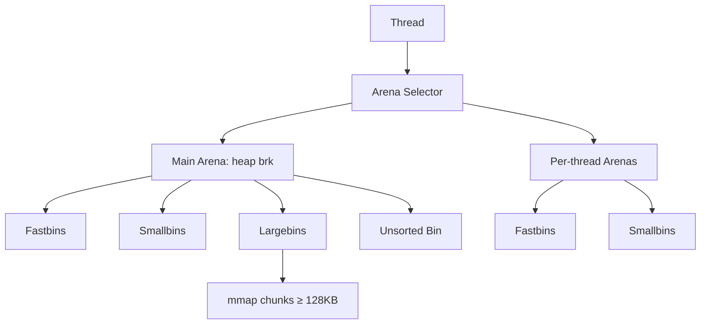

# Phase 4: Aggregator & Dashboard - Pattern Map

**Mapped:** 2026-05-19
**Files analyzed:** 15 (9 new + 6 modified)
**Analogs found:** 11 / 15 (4 greenfield: tinytemplate template, Mermaid `&str` constants, README Mermaid section, `.gitignore` already correct)

## File Classification

| New/Modified File | Role | Data Flow | Closest Analog | Match Quality |
|-------------------|------|-----------|----------------|---------------|
| `crates/alloc-bench-aggregator/src/main.rs` (rewrite) | controller (CLI entry) | request-response (one-shot batch) | `crates/alloc-bench-cli/src/main.rs` | role-match (CLI clap pattern; aggregator has no subcommands) |
| `crates/alloc-bench-aggregator/src/loader.rs` (new) | service (filesystem I/O + JSON parse) | file-I/O + transform | `crates/alloc-bench-cli/src/run.rs` `assemble_run` + `write_or_print` | role-match (file I/O + serde, but inverse direction — read not write) |
| `crates/alloc-bench-aggregator/src/html.rs` (new) | service (template render) | transform | none in workspace — GREENFIELD | no analog (first tinytemplate user) |
| `crates/alloc-bench-aggregator/src/markdown.rs` (new) | service (string-builder emission) | transform | `crates/alloc-bench-cli/src/run.rs` `write_or_print` | role-partial (writes file with serde_json::to_string_pretty; markdown.rs writes hand-rolled `format!` markdown) |
| `crates/alloc-bench-aggregator/src/recommend.rs` (new) | utility (data-derived picker) | transform | `crates/alloc-bench-core/src/scenarios/multithread.rs` `validated()` + unit tests | role-partial (pure function with comprehensive unit tests; recommend.rs is winner-pick logic, not config validation) |
| `crates/alloc-bench-aggregator/src/diagrams.rs` (new) | constants module | static data | none — GREENFIELD | no analog (first `&'static str` constants module; closest reference is research §"Mermaid Allocator Diagram Sources") |
| `crates/alloc-bench-aggregator/templates/index.html.tmpl` (new) | template asset | none (static) | none — GREENFIELD | no analog (first tinytemplate template); reference: RESEARCH.md §"Pattern 1" template excerpt |
| `crates/alloc-bench-aggregator/tests/fixtures/*.json` (new) | test fixture | static data | none — synthetic JSON files; reference shape from existing `Run` schema | no analog (synthetic data) |
| `crates/alloc-bench-aggregator/tests/smoke.rs` (new) | integration test | request-response | `crates/alloc-bench-cli/tests/run_all_smoke.rs` | exact (assert_cmd + tempfile + serde_json::Value introspection) |
| `crates/alloc-bench-core/src/output.rs` (modify) | model (schema types) | transform | `crates/alloc-bench-core/src/output.rs` itself | self (add `Deserialize` to existing derives) |
| `crates/alloc-bench-aggregator/Cargo.toml` (modify) | config | static | `crates/alloc-bench-cli/Cargo.toml` | exact (workspace=true dep style, dev-deps) |
| `Cargo.toml` workspace (modify) | config | static | `Cargo.toml` itself | self (add to `[workspace.dependencies]`) |
| `justfile` (modify) | config (recipe) | request-response | `justfile` `bench-host` recipe | exact (cargo run --release -p ... pattern) |
| `README.md` (modify) | docs | static | none — GREENFIELD | reference: UI-SPEC line 175 (locked paragraph wording) |
| `.gitignore` (no change) | config | static | `.gitignore` itself | already correct — `report/` already ignored |

## Pattern Assignments

---

### `crates/alloc-bench-aggregator/src/main.rs` (controller, request-response)

**Analog:** `crates/alloc-bench-cli/src/main.rs` (lines 1-17, 240-254)

**Imports pattern** (`alloc-bench-cli/src/main.rs:1-7`):
```rust
mod allocator;
mod build_info;
mod run;

use anyhow::Result;
use clap::{Parser, Subcommand};
```
Aggregator drops the `mod allocator` / `mod build_info` lines (no compile-time allocator selection; aggregator is allocator-agnostic per RESEARCH §"Project Constraints"). Replace with:
```rust
mod diagrams;
mod html;
mod loader;
mod markdown;
mod recommend;

use anyhow::{Context, Result};
use clap::Parser;  // no Subcommand — single-shot CLI
```

**CLI struct pattern** (`alloc-bench-cli/src/main.rs:8-17`):
```rust
#[derive(Parser)]
#[command(
    name = "alloc-bench-cli",
    version,
    about = "Memory allocator benchmark suite"
)]
struct Cli {
    #[command(subcommand)]
    cmd: Option<Cmd>,
}
```
Aggregator equivalent (no subcommands, two flags only — D-05):
```rust
#[derive(Parser)]
#[command(
    name = "alloc-bench-aggregator",
    version,
    about = "Aggregate alloc-bench results into report/index.html + REPORT.md"
)]
struct Cli {
    /// Glob pattern for input JSON files (D-05).
    #[arg(long, default_value = "results/*.json")]
    input: String,
    /// Output directory for index.html + REPORT.md (D-05).
    #[arg(long, default_value = "report/")]
    output: String,
}
```

**Main entry pattern** (`alloc-bench-cli/src/main.rs:240-254`):
```rust
fn main() -> Result<()> {
    allocator::assert_mutual_exclusion();   // skip — aggregator-irrelevant
    let cli = Cli::parse();
    match cli.cmd {
        None | Some(Cmd::Version) => {
            print_version_banner();
            Ok(())
        }
        // … 11 subcommands dispatch …
    }
}
```
Aggregator equivalent (linear pipeline per RESEARCH §"Architecture Patterns"):
```rust
fn main() -> Result<()> {
    let cli = Cli::parse();
    let outcome = loader::discover(&cli.input)?;
    std::fs::create_dir_all(&cli.output)
        .with_context(|| format!("creating output dir {}", cli.output))?;
    markdown::write(&outcome, std::path::Path::new(&cli.output))?;
    html::write(&outcome, std::path::Path::new(&cli.output))?;
    eprintln!(
        "aggregated {} runs, skipped {}",
        outcome.runs.len(),
        outcome.skipped.len()
    );
    Ok(())
}
```

**Anti-pattern to avoid:** the analog's `print_version_banner()` (`alloc-bench-cli/src/main.rs:220-238`) is for **bench binaries**. CLAUDE.md says "All bench binaries must print rustc version, target triple, allocator name at startup" — the aggregator is NOT a bench binary (RESEARCH §"Project Constraints" + Open Question 1). Do NOT copy `build_info` / `allocator::name()` into the aggregator.

---

### `crates/alloc-bench-aggregator/src/loader.rs` (service, file-I/O + transform)

**Analog:** `crates/alloc-bench-cli/src/run.rs` (lines 11-12, 117-126) — closest pattern for file I/O + serde + anyhow context.

**Imports + error context pattern** (`alloc-bench-cli/src/run.rs:11-12, 121`):
```rust
use alloc_bench_core::output::{Build, Run, ScenarioInfo};
use anyhow::{anyhow, ensure, Context, Result};
// …
std::fs::write(path, &json).with_context(|| format!("writing results to {path}"))?
```
Loader equivalent (read-side):
```rust
use alloc_bench_core::output::Run;
use alloc_bench_core::SCHEMA_VERSION;
use anyhow::{bail, Context, Result};
use glob::glob;
use std::path::{Path, PathBuf};
// …
let bytes = std::fs::read(path)
    .with_context(|| format!("reading {}", path.display()))?;
```

**Schema version invariant pattern** (`alloc-bench-cli/src/run.rs:100-102`):
```rust
Ok(Run {
    schema_version: SCHEMA_VERSION,  // single source of truth — always `alloc_bench_core::SCHEMA_VERSION`
    run_id,
    // …
})
```
Loader rejects on mismatch (per D-06; mirroring the run-all smoke test assertion in `run_all_smoke.rs:96-100`):
```rust
if run.schema_version != SCHEMA_VERSION {
    bail!(
        "schema_version mismatch in {}: got {}, expected {}",
        path.display(), run.schema_version, SCHEMA_VERSION
    );
}
```

**Validated config pattern** (referencing `crates/alloc-bench-core/src/scenarios/multithread.rs:39-69`):
```rust
impl MultithreadConfig {
    pub fn validated(self) -> anyhow::Result<Self> {
        anyhow::ensure!(self.size_min >= 1, "size_min must be >= 1 (got {})", self.size_min);
        // …
        Ok(self)
    }
}
```
Loader doesn't need `validated()` (no config struct), but the aggregator's CLI may benefit:
```rust
impl Cli {
    fn validated(self) -> Result<Self> {
        anyhow::ensure!(!self.input.is_empty(), "--input must not be empty");
        anyhow::ensure!(!self.output.is_empty(), "--output must not be empty");
        Ok(self)
    }
}
```

**Heterogeneous parse pattern (Vec<Run> first, then Run fallback)** — RESEARCH §"Pattern 2" excerpt is canonical:
```rust
fn load_one(path: &Path) -> Result<Vec<Run>> {
    let bytes = std::fs::read(path)
        .with_context(|| format!("reading {}", path.display()))?;
    // Try array first — Phase-3 dominant case (per crates/alloc-bench-cli/tests/run_all_smoke.rs:57)
    if let Ok(arr) = serde_json::from_slice::<Vec<Run>>(&bytes) {
        for r in &arr {
            if r.schema_version != SCHEMA_VERSION {
                bail!("schema_version mismatch in {}: got {}, expected {}",
                      path.display(), r.schema_version, SCHEMA_VERSION);
            }
        }
        return Ok(arr);
    }
    // Fallback: single Run object (Phase-1 single-scenario emission shape)
    let single: Run = serde_json::from_slice(&bytes)
        .with_context(|| format!("parsing {} (tried Vec<Run> then Run)", path.display()))?;
    if single.schema_version != SCHEMA_VERSION {
        bail!("schema_version mismatch in {}: got {}, expected {}",
              path.display(), single.schema_version, SCHEMA_VERSION);
    }
    Ok(vec![single])
}
```

**Glob + sort_unstable pattern** (RESEARCH §"Pitfall 3"):
```rust
let mut paths: Vec<PathBuf> = glob(pattern)
    .with_context(|| format!("invalid glob pattern: {pattern}"))?
    .filter_map(|r| r.ok())
    .collect();
if paths.is_empty() {
    bail!("no results found matching pattern \"{pattern}\"");
}
paths.sort_unstable();  // glob iteration order is undefined per glob-0.3.3/src/lib.rs
```

**Skip-and-continue pattern** (D-08; mirrors Phase-2 run-all `panic::catch_unwind` per-scenario isolation in `crates/alloc-bench-cli/src/run.rs:799-830`):
```rust
let mut runs = Vec::new();
let mut skipped = Vec::new();
for path in paths {
    match load_one(&path) {
        Ok(mut more) => runs.append(&mut more),
        Err(e) => {
            eprintln!("warn: skipped {}: {}", path.display(), e);
            skipped.push(SkippedFile { path, reason: e.to_string() });
        }
    }
}
```
This mirrors run-all's "continue on per-scenario failure" pattern at `run.rs:790-831`. Both functions emit per-failure stderr warnings + collect failures into a side channel.

---

### `crates/alloc-bench-aggregator/src/html.rs` (service, transform)

**Analog:** GREENFIELD — no tinytemplate user in the workspace yet.

**Reference:** RESEARCH.md §"Pattern 1: tinytemplate with single placeholder + escaped CSS/JS body" (lines 258-373).

**Imports + structure** (synthesized from RESEARCH §Pattern 1):
```rust
use anyhow::{Context, Result};
use tinytemplate::TinyTemplate;

const TEMPLATE: &str = include_str!("../templates/index.html.tmpl");

#[derive(serde::Serialize)]
struct HtmlContext<'a> {
    results_json: &'a str,    // pre-serialized JSON, rendered via { results_json | unescaped }
    run_count: usize,
    cell_count: usize,
    timestamp_iso8601: &'a str,
    plotly_cdn_url: &'a str,
    plotly_sri_hash: &'a str,
}

const PLOTLY_CDN_URL: &str = "https://cdn.plot.ly/plotly-2.35.3.min.js";
const PLOTLY_SRI_HASH: &str =
    "sha384-MqL7Cy3itNqCI1Wlc926K0XhyRKJ/NMqTaytIIEB+QIdInOploxqRIHRKLlhPykM";

pub fn render(runs: &[Run]) -> Result<String> {
    let mut tt = TinyTemplate::new();
    tt.add_template("index", TEMPLATE)
        .context("compiling index.html.tmpl")?;
    let json = serde_json::to_string(runs).context("serializing runs to JSON")?;
    let timestamp = chrono::Utc::now().to_rfc3339();
    let ctx = HtmlContext {
        results_json: &json,
        run_count: runs.len(),
        cell_count: count_unique_cells(runs),
        timestamp_iso8601: &timestamp,
        plotly_cdn_url: PLOTLY_CDN_URL,
        plotly_sri_hash: PLOTLY_SRI_HASH,
    };
    tt.render("index", &ctx).context("rendering index.html")
}
```

**chrono import precedent** (`crates/alloc-bench-cli/src/run.rs:80`):
```rust
let run_id = format!("{}-{sha8}", chrono::Utc::now().to_rfc3339());
```
Uses workspace `chrono` (see `Cargo.toml:19`), `default-features = false, features = ["clock", "serde"]` — same import style applies.

**File write pattern** (`alloc-bench-cli/src/run.rs:121`):
```rust
std::fs::write(path, &json).with_context(|| format!("writing results to {path}"))?
```
Aggregator equivalent for HTML:
```rust
let html = render(&outcome.runs)?;
let out_path = output_dir.join("index.html");
std::fs::write(&out_path, &html)
    .with_context(|| format!("writing {}", out_path.display()))?;
```

**Brace-escaping rule (CRITICAL):** every literal `{` in CSS/JS body inside `index.html.tmpl` must be `\{`. See RESEARCH §"Pitfall 1" + UI-SPEC §"Layout Color Tokens". The `:root \{ … }` block is the canonical pattern.

---

### `crates/alloc-bench-aggregator/src/markdown.rs` (service, transform)

**Analog:** `crates/alloc-bench-cli/src/run.rs:117-126` (file write with serde_json) — partial match (output direction is right; format is `format!`-built markdown not JSON).

**File write pattern** (same `with_context` shape; `alloc-bench-cli/src/run.rs:117-126`):
```rust
pub(crate) fn write_or_print(run: &Run, output: Option<&str>) -> Result<()> {
    let json = serde_json::to_string_pretty(run)?;
    match output {
        Some(path) => {
            std::fs::write(path, &json)
                .with_context(|| format!("writing results to {path}"))?
        }
        None => println!("{json}"),
    }
    Ok(())
}
```
Markdown.rs equivalent (always writes — no stdout fallback per main.rs orchestration):
```rust
pub fn write(outcome: &LoadOutcome, out_dir: &Path) -> Result<()> {
    let mut buf = String::new();
    emit_header(&mut buf);
    emit_per_scenario_tables(&mut buf, &outcome.runs);
    emit_docker_runtime_table(&mut buf, &outcome.runs);
    emit_recommendations(&mut buf, &outcome.runs);
    emit_allocator_diagrams(&mut buf);
    if !outcome.skipped.is_empty() {
        emit_skipped_inputs(&mut buf, &outcome.skipped);
    }
    let out_path = out_dir.join("REPORT.md");
    std::fs::write(&out_path, &buf)
        .with_context(|| format!("writing {}", out_path.display()))?;
    Ok(())
}
```

**Sorted-output pattern (byte-identical contract; RESEARCH §"Pitfall 5"):**
- Use `BTreeMap`, never `HashMap`, for any per-key aggregation.
- Sort allocators / scenarios / envs alphabetically before any table emission.
- Format integers as `{}`, latency ns as `{} ns`, throughput as `{:.1}`, percentages as `{:+.1}%`.

**Hand-rolled markdown table pattern** (RESEARCH §"Don't Hand-Roll" — Rust width specifiers OK):
```rust
use std::fmt::Write;
writeln!(buf, "| {:<20} | {:>12} | {:>12} | {:>12} |",
    "allocator", "throughput", "p50 (ns)", "p99 (ns)").unwrap();
writeln!(buf, "|{:-<22}|{:->14}|{:->14}|{:->14}|", "", "", "", "").unwrap();
```

**Image_size_mb absent handling** (RESEARCH §"Pitfall 6"):
```rust
// Docker comparison table cell — emit `—` for fields not present in v1 schema.
let image_size_cell = match env_to_image_sizes.get(&env_label) {
    Some(mb) => format!("{} MB", mb),
    None => "—".to_string(),  // U+2014 EM DASH
};
```
Comment in REPORT.md: `*image size column populated from CI in Phase 5 (REPR-03).*`

**Image size lookup is intentionally indirect** — do NOT add an `image_size_mb` field to `Env`; per Pitfall §6, the aggregator must run on a Docker-less host. v1 emits `—`; Phase-5 CI will inject via `docker inspect`.

---

### `crates/alloc-bench-aggregator/src/recommend.rs` (utility, transform)

**Analog:** `crates/alloc-bench-core/src/scenarios/multithread.rs:39-69` (validated config + comprehensive unit tests at `:157-231`) — partial match (comprehensive unit-test pattern; the picker logic is greenfield).

**Unit test pattern** (`crates/alloc-bench-core/src/scenarios/multithread.rs:157-231`):
```rust
#[cfg(test)]
mod tests {
    use super::*;

    fn cfg(threads: usize, objects: usize, size_min: usize, size_max: usize) -> MultithreadConfig {
        MultithreadConfig {
            threads, objects,
            size_dist: SizeDist::Uniform,
            size_min, size_max,
            seed: 1,
        }
    }

    #[test]
    fn validated_rejects_zero_size_min() {
        let err = cfg(1, 1, 0, 16).validated().unwrap_err();
        assert!(err.to_string().contains("size_min must be >= 1"));
    }

    #[test]
    fn validated_accepts_well_formed_config() {
        let c = cfg(2, 100, 16, 1024).validated();
        assert!(c.is_ok());
    }
}
```
Recommend.rs equivalent (synthetic `Run` builder + per-test assertions; pattern is identical):
```rust
#[cfg(test)]
mod tests {
    use super::*;

    fn synth_run(alloc: &str, scenario: &str, ticks_per_s: f64) -> Run { /* … */ }

    #[test]
    fn winner_picker_emits_data_derived_rationale() {
        let runs = vec![
            synth_run("jemalloc", "cpu-bound", 100.0),
            synth_run("mimalloc", "cpu-bound", 110.0),
            synth_run("ptmalloc", "cpu-bound", 80.0),
        ];
        let rec = recommend_for_workload(&runs, WorkloadClass::CpuBound).unwrap();
        assert_eq!(rec.winner, "mimalloc");
        assert!(rec.rationale.contains("+10"), "got: {}", rec.rationale);
        assert!(rec.rationale.contains("vs jemalloc"));
    }

    #[test]
    fn winner_picker_handles_single_allocator() {
        let runs = vec![synth_run("ptmalloc", "web", 100.0)];
        let rec = recommend_for_workload(&runs, WorkloadClass::Web).unwrap();
        assert!(rec.rationale.contains("insufficient comparative data"));
    }

    #[test]
    fn suspect_predicate_low_samples() {
        let h = HarnessInfo { samples_count: 9_999, warmup_duration_s: 5.0, measurement_duration_s: 5.0 };
        assert!(is_suspect(&h));
    }

    #[test]
    fn suspect_predicate_low_warmup() {
        let h = HarnessInfo { samples_count: 10_000, warmup_duration_s: 4.99, measurement_duration_s: 5.0 };
        assert!(is_suspect(&h));
    }

    #[test]
    fn suspect_predicate_passing_thresholds() {
        // Boundary not strict — `< 10_000` and `< 5.0`, so 10_000 / 5.0 are NOT suspect.
        let h = HarnessInfo { samples_count: 10_000, warmup_duration_s: 5.0, measurement_duration_s: 5.0 };
        assert!(!is_suspect(&h));
    }
}
```

**Anti-pattern from RESEARCH §"Pitfall 7":** do NOT hard-code recommendations like `"use jemalloc for web"`. Every claim must be derived from the input data; emit `"insufficient comparative data"` if only one allocator was measured for a workload class.

**Suspect predicate** (D-07, RESEARCH §"Pattern 2"): exact thresholds are `samples_count < 10_000` OR `warmup_duration_s < 5.0`. Boundary is strict-less-than (NOT less-than-or-equal); a run with exactly 10_000 samples is NOT suspect.

---

### `crates/alloc-bench-aggregator/src/diagrams.rs` (constants module, static data)

**Analog:** GREENFIELD — no `&'static str` constants module exists in the workspace.

**Reference:** RESEARCH.md §"Code Examples §7" (line 802-823) + §"Mermaid Allocator Diagram Sources" (lines 840-887).

**Pattern (synthesized from research):**
```rust
//! Static Mermaid `flowchart TD` constants for the four allocators.
//! Sources cited per allocator. Diagrams change only when our understanding
//! of the allocator changes, NOT per benchmark run (D-11). Emitted verbatim
//! into REPORT.md by `markdown.rs`.

/// ptmalloc (glibc) — Source: https://en.wikipedia.org/wiki/C_dynamic_memory_allocation
pub const PTMALLOC_DIAGRAM: &str = r#"

"#;

// MALLOCNG_DIAGRAM, JEMALLOC_DIAGRAM, MIMALLOC_DIAGRAM follow the same shape.
// Each: ~10-15 nodes, single-line raw string, `flowchart TD`, NO `\{` escaping
// needed because Mermaid syntax doesn't conflict with tinytemplate (this file
// emits straight markdown, not tinytemplate-rendered HTML).
```

**Diagram order in REPORT.md:** alphabetical (jemalloc, mallocng, mimalloc, ptmalloc) per UI-SPEC line 171 — supports byte-identical-output contract.

**Source URL convention:** put the upstream README / Wikipedia URL in a Rust doc comment above each constant so a reviewer can spot-check against current upstream (Assumption A5 mitigation).

---

### `crates/alloc-bench-aggregator/templates/index.html.tmpl` (template asset, none)

**Analog:** GREENFIELD — first tinytemplate template in the workspace.

**Reference:** RESEARCH.md §"Pattern 1" (lines 318-373) — full template excerpt.

**Critical rules:**
1. **Every literal `{` is escaped `\{`** (RESEARCH §"Pitfall 1"). Closing `}` does NOT need escaping.
2. **`{ results_json | unescaped }`** is the single value-substitution placeholder for the inlined JSON; the `unescaped` formatter prevents HTML-escaping of `<`/`>`/`&`/`"` inside the JSON blob.
3. **Inline `<style>` block** uses `:root \{ --color-dominant: #FFFFFF; … }` — see UI-SPEC §"Layout Color Tokens (single source of truth)" lines 302-341 for the exact CSS variable values.
4. **CDN script tag** uses pinned version + SRI integrity + crossorigin (RESEARCH §"Code Examples §5"):
   ```html
   <script
     src="{plotly_cdn_url}"
     integrity="{plotly_sri_hash}"
     crossorigin="anonymous"></script>
   ```
5. **Inline `<script>` block** (~150 LOC vanilla JS) — every `{` in JS bodies escaped `\{`. UI-SPEC §"Multi-Select Interaction Contract" + RESEARCH §"Pattern 3" + §"Code Examples §1-§4" provide the canonical chart/filter code.

**Test that compiles the template** (RESEARCH §"Test Strategy" → `tinytemplate_compiles_index_template`):
```rust
#[test]
fn tinytemplate_compiles_index_template() {
    let mut tt = TinyTemplate::new();
    tt.add_template("index", include_str!("../templates/index.html.tmpl"))
        .expect("template should compile — missed `\\{` escape?");
}
```
This test catches an unescaped `{` regression at `cargo test` time, before the bug reaches a runtime mystery.

---

### `crates/alloc-bench-aggregator/tests/fixtures/*.json` (test fixture, static data)

**Analog:** none — synthetic JSON files. Reference shape is the actual `Run` schema (`crates/alloc-bench-core/src/output.rs:5-25`).

**Reference for shape:** `crates/alloc-bench-core/src/output.rs:191-275` `run_canonical_shape_snapshot` test — enumerates the canonical SCHEMA_VERSION=1 top-level keys: `build, env, harness, metrics, run_id, scenario, schema_version, status` (and optionally `error`).

**Three fixture files per RESEARCH §"Test Strategy":**
- `ptmalloc-debian-slim.json` — `Vec<Run>` array of 2 scenarios, both `status: "success"`.
- `jemalloc-alpine.json` — `Vec<Run>` of 2 scenarios, one with `samples_count: 5000` (suspect predicate triggers).
- `mimalloc-distroless-cc-single.json` — single `Run` object (Phase-1 emission shape) for one scenario; tests the loader's `Run` fallback path.

**Field values** can be sentinel/synthetic:
- `cpu_model: "test-cpu"`, `memory_total_kb: 1`, `cpu_count: 1`.
- `allocator_stats: {}` (empty `serde_json::Value`).
- `rss_growth_samples: []` is acceptable.
- Throughput numbers should differ enough that recommendations table picks deterministic winners (e.g., 100, 110, 80 ticks_per_s — same as the unit-test example).

**Note on Phase-1 vs Phase-2 fixtures:** for the single-`Run`-object fixture, do NOT include `status` or `error` keys (Phase-1 single-scenario emission omits them). For the array fixtures, include `status: "success"` (Phase-2 run-all always emits it).

---

### `crates/alloc-bench-aggregator/tests/smoke.rs` (integration test, request-response)

**Analog:** `crates/alloc-bench-cli/tests/run_all_smoke.rs` (lines 20-26, 40-58) — exact match.

**Imports pattern** (`run_all_smoke.rs:20-26`):
```rust
use std::collections::HashSet;
use std::path::PathBuf;

use assert_cmd::Command;
use serde_json::Value;
use tempfile::tempdir;
```

**Test setup pattern** (`run_all_smoke.rs:40-53`):
```rust
#[test]
fn run_all_emits_one_record_per_scenario() {
    let dir = tempdir().expect("tempdir");
    let out: PathBuf = dir.path().join("all.json");

    let mut cmd = Command::cargo_bin("alloc-bench-cli").expect("cargo bin");
    cmd.args(["run-all", "--seed", "12345", "--output"])
        .arg(&out);
    cmd.assert().success();

    let raw = std::fs::read_to_string(&out).expect("read all.json");
    let v: Value = serde_json::from_str(&raw).expect("parse all.json");
    let arr = v.as_array().expect("run-all output must be a JSON array");
    // …
}
```
Aggregator equivalent:
```rust
#[test]
fn aggregator_emits_html_and_markdown_against_fixtures() {
    let out_dir = tempdir().expect("tempdir");

    let fixtures = std::path::Path::new(env!("CARGO_MANIFEST_DIR"))
        .join("tests/fixtures");
    let pattern = format!("{}/*.json", fixtures.display());

    let mut cmd = Command::cargo_bin("alloc-bench-aggregator").expect("cargo bin");
    cmd.args(["--input"]).arg(&pattern)
        .args(["--output"]).arg(out_dir.path());
    cmd.assert().success();

    let html = std::fs::read_to_string(out_dir.path().join("index.html"))
        .expect("read index.html");
    assert!(html.contains("Plotly.react"), "expected Plotly.react in HTML");
    assert!(html.contains("sha384-MqL7Cy3i"), "expected SRI integrity hash");
    assert!(html.contains("const RESULTS = ["), "expected inlined results array");

    let md = std::fs::read_to_string(out_dir.path().join("REPORT.md"))
        .expect("read REPORT.md");
    assert!(md.contains("## Recommendations by workload"), "expected recommendations heading");
    assert!(md.contains("```mermaid"), "expected Mermaid block");
    assert!(md.contains("✓ "), "expected ✓ winner prefix in at least one table row");
}

#[test]
fn aggregator_zero_glob_matches_exits_nonzero() {
    let empty = tempdir().expect("tempdir");
    let pattern = format!("{}/*.json", empty.path().display());
    let mut cmd = Command::cargo_bin("alloc-bench-aggregator").expect("cargo bin");
    cmd.args(["--input"]).arg(&pattern)
        .args(["--output"]).arg(empty.path());
    cmd.assert().failure().stderr(predicates::str::contains("no results found"));
}

#[test]
fn aggregator_schema_version_mismatch_exits_nonzero() {
    let dir = tempdir().expect("tempdir");
    std::fs::write(dir.path().join("bad.json"), r#"{"schema_version":999}"#).unwrap();
    let pattern = format!("{}/*.json", dir.path().display());
    let mut cmd = Command::cargo_bin("alloc-bench-aggregator").expect("cargo bin");
    cmd.args(["--input"]).arg(&pattern)
        .args(["--output"]).arg(dir.path());
    cmd.assert().failure().stderr(predicates::str::contains("bad.json"));
}
```

Note: `run_all_smoke.rs` does NOT use `predicates` (it relies on `cmd.assert().success()` only). The smoke test for the aggregator additionally needs `predicates::str::contains` to assert error-message content; either add `predicates = "3"` to dev-deps, or fall back to capturing stderr via `cmd.output()` and asserting on `String::from_utf8(output.stderr)`.

**Mutual-exclusion shape assertions pattern** (`run_all_smoke.rs:140-159`):
```rust
if status == "success" {
    assert!(ticks > 0.0, "{name}: status=success but ticks_per_s={ticks}");
    assert!(error_value.is_null(), "{name}: status=success must omit error, got {error_value:?}");
} else {
    let error_str = error_value
        .as_str()
        .unwrap_or_else(|| panic!("{name}: status=failed but error is not a string"));
    assert!(!error_str.is_empty(), "{name}: status=failed but error string is empty");
    assert_eq!(ticks, 0.0, "{name}: status=failed must zero ticks_per_s, got {ticks}");
}
```
This pattern (asserting both branches of a mutually-exclusive invariant in one test) translates directly to the aggregator's "loaded valid runs vs. skipped runs" assertions — though for Phase 4's smoke the invariant is simpler (HTML + REPORT.md exist + contain expected substrings).

---

### `crates/alloc-bench-core/src/output.rs` (model modification, transform)

**Analog:** the file itself (`crates/alloc-bench-core/src/output.rs:1-2`) — self-modify.

**Current state** (`output.rs:1-2, 5-6`):
```rust
use serde::Serialize;

pub const SCHEMA_VERSION: u32 = 1;

#[derive(Debug, Serialize)]
pub struct Run { /* … */ }
```

**Modification (per RESEARCH §"Pattern 2 — Deserialize derive on the v1 schema"):**
```rust
use serde::{Deserialize, Serialize};

pub const SCHEMA_VERSION: u32 = 1;

#[derive(Debug, Serialize, Deserialize)]
pub struct Run { /* identical fields */ }
```

Apply `Deserialize` to all 9 schema structs:
- `Run` (line 5)
- `Env` (line 27)
- `Build` (line 38)
- `ScenarioInfo` (line 51)
- `HarnessInfo` (line 64)
- `LatencyNs` (line 73)
- `RssGrowthSample` (line 82)
- `Rusage` (line 88)
- `Metrics` (line 346)

**Critical constraints (per RESEARCH §"Pattern 2"):**
1. Do NOT add `#[serde(default)]` — every required field is required by Phase-1 schema lock; every optional field is already `Option<T>` (which has `Default` impl).
2. Do NOT add `#[serde(deny_unknown_fields)]` — that breaks D-06's forward-compat contract (unknown additive fields must be silently dropped).
3. The existing `#[serde(skip_serializing_if = "Option::is_none")]` attributes (lines 19, 23, 31, 60) do NOT interfere with deserialize — they only affect serialize.
4. The existing tests (`run_with_none_status_omits_status_and_error_keys` line 109, `run_canonical_shape_snapshot` line 191, `run_with_failed_status_emits_status_and_error_keys` line 281) continue to pass because they assert serialize shape, not derive list.

**Verification step:** plan-phase should add a `#[test] fn deserialize_round_trips_a_canonical_run()` proving:
```rust
let run = make_canonical_run();
let json = serde_json::to_string(&run)?;
let back: Run = serde_json::from_str(&json)?;
// Assert key fields round-trip.
assert_eq!(back.schema_version, run.schema_version);
assert_eq!(back.scenario.name, run.scenario.name);
```
This pins the round-trip invariant and gates against future changes that break it (e.g., a maintainer making a field non-Option without adding `#[serde(default)]`).

---

### `crates/alloc-bench-aggregator/Cargo.toml` (config modification, static)

**Analog:** `crates/alloc-bench-cli/Cargo.toml` — exact match.

**Current aggregator state** (`crates/alloc-bench-aggregator/Cargo.toml:1-11`):
```toml
[package]
name = "alloc-bench-aggregator"
version = "0.1.0"
edition.workspace = true
license.workspace = true
rust-version.workspace = true

[[bin]]
name = "alloc-bench-aggregator"
path = "src/main.rs"
```

**CLI analog dep declaration style** (`crates/alloc-bench-cli/Cargo.toml:17-32`):
```toml
[dependencies]
alloc-bench-core = { path = "../alloc-bench-core" }
clap = { workspace = true }
anyhow = { workspace = true }
serde_json = { workspace = true }
chrono = { workspace = true }

# … allocator features …

[dev-dependencies]
assert_cmd = "2"
tempfile = "3"
```

**Aggregator equivalent (per RESEARCH §"Standard Stack" lines 142-167):**
```toml
[dependencies]
alloc-bench-core = { path = "../alloc-bench-core" }
anyhow = { workspace = true }
chrono = { workspace = true }
clap = { workspace = true }
glob = { workspace = true }            # NEW — added at workspace level
serde = { workspace = true }
serde_json = { workspace = true }
tinytemplate = { workspace = true }    # NEW — added at workspace level

[dev-dependencies]
assert_cmd = "2"
tempfile = "3"
```

**Note:** the analog (`alloc-bench-cli`) does NOT declare `serde` directly — only `serde_json`. The aggregator needs `serde` directly because its `HtmlContext` struct needs `#[derive(serde::Serialize)]` for tinytemplate. Add it.

**Slopcheck note (RESEARCH §"Package Legitimacy Audit"):** `glob = "0.3"` was flagged [SUS] by slopcheck as a typosquat for `log`. False positive — it's `rust-lang-owner`'s canonical Unix-glob crate (441M downloads). Plan-phase should drop a brief comment in the dep-add task so a future reader doesn't re-debate it.

---

### `Cargo.toml` workspace root (config modification, static)

**Analog:** the file itself (`Cargo.toml:12-32`) — self-modify.

**Current `[workspace.dependencies]` shape** (`Cargo.toml:12-32`):
```toml
[workspace.dependencies]
clap = { version = "4.5", features = ["derive"] }
serde = { version = "1", features = ["derive"] }
serde_json = "1"
hdrhistogram = "7.5"
libc = "0.2"
rand = { version = "0.8", features = ["small_rng"] }
chrono = { version = "0.4", default-features = false, features = ["clock", "serde"] }
anyhow = "1"
# … 10 more deps …
```

**Modification (per RESEARCH §"Standard Stack" lines 134-139):**
```toml
[workspace.dependencies]
# … existing deps preserved verbatim …
tinytemplate = "1"      # NEW — Phase 4 D-14
glob         = "0.3"    # NEW — Phase 4 D-14
```

**Style:** existing deps mix simple `"1"`/`"0.3"` with `{ version = "...", features = [...] }`. Both `tinytemplate` and `glob` are simple-version style — neither needs feature gating. Insert in alphabetical-ish order at the bottom of the table or between existing entries; Phase 3 added `rayon` at the end so the convention is "append, don't sort the whole table".

---

### `justfile` (config modification, request-response)

**Analog:** `justfile:218-226` `bench-host` recipe — exact match for the `cargo run --release -p ...` shape.

**Pattern excerpt** (`justfile:218-226`):
```just
# Native macOS / Linux host bench — libmalloc / ptmalloc baseline (D-18, D-19).
# No Docker. .cargo/config.toml's `target-cpu=native` is honored automatically;
# Cargo picks the host triple. Output is `results/host-system.json` (D-18
# literal filename). Prints the host triple via `rustc -vV` for traceability.
bench-host:
    #!/usr/bin/env bash
    set -euo pipefail
    mkdir -p results
    cargo build --release -p alloc-bench-cli
    target/release/alloc-bench-cli run-all --output results/host-system.json --seed 7
    HOST=$(rustc -vV | awk '/^host:/ {print $2}')
    echo "[host] target=$HOST"
    echo "[host] wrote results/host-system.json"
```

**`run-all-smoke` recipe pattern** (`justfile:22-26`) — closer match for the `aggregate-smoke` shape:
```just
# Run the smoke test for the run-all command — produces 10 records.
run-all-smoke OUTPUT='/tmp/alloc-bench-runall.json':
    cargo build --release --bin alloc-bench-cli
    target/release/alloc-bench-cli run-all --output {{OUTPUT}} --seed 7
    @echo "--- Run summary ---"
    @jq '[.[] | {name: .scenario.name, status: .status, ticks_per_s: .metrics.ticks_per_s}]' {{OUTPUT}}
```

**Aggregator equivalent (RESEARCH §"State on Existing Justfile" lines 1001-1013):**
```just
# Phase 4: Aggregator (ORCH-03, AGG-01).
# Reads results/*.json, emits report/index.html + REPORT.md.
aggregate:
    cargo run --release -p alloc-bench-aggregator -- \
        --input "results/*.json" --output report/

# Phase 4 smoke variant — runs aggregator against the committed fixtures.
# Useful for `prek` pre-commit gate: catches a broken template / loader
# regression before push.
aggregate-smoke:
    cargo test --release -p alloc-bench-aggregator --test smoke
```

**No reconciliation needed:** the existing `dce-check`, `run-all-smoke`, `build`, `run`, `bench-cell`, `bench-all`, `bench-all-smoke`, `bench-host`, `dive-check`, `dive-check-all`, `clean-images`, `check-matrix` recipes are not affected. Append both new recipes at the bottom of the justfile.

**Style note:** existing recipes use full-line comments above the recipe (lines 9-17 for `dce-check`, 21-22 for `run-all-smoke`, 88-93 for `run`); aggregator recipes follow the same shape.

---

### `README.md` (docs modification, static)

**Analog:** GREENFIELD — no precedent in the workspace for a Mermaid system diagram.

**Reference:** UI-SPEC line 175 locks the paragraph wording verbatim:

> "When a Rust program calls `Vec::new()` or `Box::new(x)`, the request travels through `std::alloc` → the configured `#[global_allocator]` (jemalloc / mimalloc / system) → libc malloc (ptmalloc on glibc, mallocng on musl) → the kernel's `mmap` / `brk` / `sbrk` → physical memory. Each layer can change the cost, fragmentation profile, and tail-latency shape of an allocation. This benchmark measures those differences across four allocators, six libc·env combinations, and eleven workload scenarios."

**Mermaid diagram:** RESEARCH §"Code Examples §8" (lines 826-838) provides the exact 8-node `flowchart TD`.

**Insertion point:** UI-SPEC line 174 — directly after `# rust-benchmark-glibc-musl-mimalloc` (the existing single-line H1 at `README.md:1`), before any other content. Phase 5 will append the "Run it yourself" walkthrough below this section.

**Section heading:** `## How memory allocation works on Linux` (UI-SPEC line 174 / D-13 locked).

**Constraint:** D-13 says "The aggregator does NOT mutate README.md automatically." Plan-phase delivers this as a static commit; do NOT add a code path in the aggregator that touches README.md.

---

### `.gitignore` (no change needed)

**Analog:** the file itself (`.gitignore:1-7`) — already correct.

**Current state:**
```
target/
**/*.rs.bk
*.swp
.DS_Store
results/
report/
```

`report/` is already ignored (line 6). Generated `index.html` and `REPORT.md` are excluded from commits per Open Question 3 in RESEARCH.md. **No modification needed.**

---

## Shared Patterns

### `with_context` error-attribution pattern

**Source:** `crates/alloc-bench-cli/src/run.rs:121, 423-454`
**Apply to:** every `std::fs::*` and `serde_json::*` call in `loader.rs` / `markdown.rs` / `html.rs`.

```rust
std::fs::write(path, &json)
    .with_context(|| format!("writing results to {path}"))?
```

Always use `with_context(|| format!(...))` (the closure-form), not `context(format!(...))` (the eager form). The closure form defers the formatting cost to the error path.

### `bail!` for invariant-violation errors

**Source:** `crates/alloc-bench-cli/src/run.rs:50-52`
**Apply to:** schema-version mismatch + zero-glob-match + invalid CLI args.

```rust
Err(anyhow!("invalid duration: {s} (expected suffix ms|s|m, e.g. 5s)"))
// or equivalently:
bail!("schema_version mismatch in {}: got {}, expected 1", path.display(), got);
```

`bail!` returns immediately with `anyhow::Error::msg(...)`. Equivalent to `return Err(anyhow!(...))`. Convention in the workspace: use `bail!` when the message is a constant + a few interpolations; use `Err(anyhow!(...))` when the construction is more elaborate.

### `ensure!` for argument validation

**Source:** `crates/alloc-bench-core/src/scenarios/multithread.rs:46-66`
**Apply to:** the aggregator's `Cli::validated()` if added; not strictly required because clap handles missing/malformed args.

```rust
anyhow::ensure!(self.size_min >= 1, "size_min must be >= 1 (got {})", self.size_min);
```

`ensure!(cond, msg, args...)` is sugar for `if !cond { bail!(msg, args); }`. Convention in `multithread.rs:39-69` (`validated()`) extends to all 9 scenario configs in `crates/alloc-bench-core/src/scenarios/*.rs`.

### `assert_cmd::Command::cargo_bin` integration test pattern

**Source:** `crates/alloc-bench-cli/tests/run_all_smoke.rs:23-26, 45-53`
**Apply to:** `tests/smoke.rs` of the aggregator + any future binary smoke.

```rust
use assert_cmd::Command;
use serde_json::Value;
use tempfile::tempdir;

#[test]
fn name() {
    let dir = tempdir().expect("tempdir");
    let mut cmd = Command::cargo_bin("alloc-bench-aggregator").expect("cargo bin");
    cmd.args(["--input"]).arg(&pattern)
        .args(["--output"]).arg(dir.path());
    cmd.assert().success();   // or .failure()
}
```

The dep declarations are already in `crates/alloc-bench-cli/Cargo.toml:30-32`:
```toml
[dev-dependencies]
assert_cmd = "2"
tempfile = "3"
```
Both versions have been validated against Phase 1+2+3 tests; reuse the same versions in the aggregator.

### Sorted-output / byte-identical-output pattern

**Source:** RESEARCH.md §"Pitfall 5" + UI-SPEC §"Print and Screenshot Friendliness" line 295
**Apply to:** `loader.rs` (sort glob paths), `markdown.rs` (sort allocators / scenarios / envs alphabetically), `recommend.rs` (deterministic winner pick when ties), `html.rs` (sort allocator series alphabetically before `Plotly.react`).

| Source of non-determinism | Mitigation |
|---------------------------|------------|
| `glob::Paths` iteration order | `paths.sort_unstable()` after `collect` |
| `HashMap` iteration order | use `BTreeMap` instead |
| Floating-point formatting | `{:.1}%` for percentages, `{} ns` for latencies, `{:.1}` for throughput |
| Generation timestamp | Single timestamp at top of REPORT.md (regex-stripped in snapshot tests) |

### Workspace dependency declaration style

**Source:** `crates/alloc-bench-cli/Cargo.toml:17-23`
**Apply to:** `crates/alloc-bench-aggregator/Cargo.toml`.

Always use `{ workspace = true }` for any dep declared in the root `[workspace.dependencies]` table. Never duplicate the version literal in a leaf crate's Cargo.toml.

```toml
# Correct (style in alloc-bench-cli):
clap = { workspace = true }

# Wrong (would diverge from workspace pin):
# clap = "4.5"
```

This pattern is enforced by the workspace itself — declaring `clap = "4.5"` in a leaf crate works but bypasses the central pin and creates drift risk.

## No Analog Found

Files with no close match in the codebase (planner should use RESEARCH.md / UI-SPEC excerpts as primary references):

| File | Role | Data Flow | Reason | Reference |
|------|------|-----------|--------|-----------|
| `crates/alloc-bench-aggregator/src/html.rs` | service | transform | First tinytemplate user; no other template engine used in workspace | RESEARCH.md §"Pattern 1" lines 258-373 |
| `crates/alloc-bench-aggregator/src/diagrams.rs` | constants module | static | First `&'static str` constants module; no other Mermaid emission in workspace | RESEARCH.md §"Code Examples §7" + §"Mermaid Allocator Diagram Sources" lines 840-887 |
| `crates/alloc-bench-aggregator/templates/index.html.tmpl` | template asset | none | First HTML template; first tinytemplate template; no precedent | RESEARCH.md §"Pattern 1" lines 318-373 + UI-SPEC §"Layout Color Tokens" lines 302-341 |
| `README.md` (Mermaid section) | docs | static | No precedent for Mermaid system diagram in repo | UI-SPEC line 175 (paragraph) + RESEARCH.md §"Code Examples §8" (Mermaid block) |

For these four files the planner should treat RESEARCH.md / UI-SPEC excerpts as **the analog** (text-quoted into the plan's action section). The cited line ranges are stable references; do not paraphrase, copy verbatim where the wording is locked (UI-SPEC line 175 paragraph, RESEARCH §Pattern 1 template structure, RESEARCH §Code Examples §8 README diagram).

## Metadata

**Analog search scope:**
- `crates/alloc-bench-cli/src/` (CLI patterns: clap, run dispatch, `with_context`, `bail!`)
- `crates/alloc-bench-cli/tests/` (integration test patterns: `assert_cmd`, `tempfile`)
- `crates/alloc-bench-core/src/output.rs` (schema struct serde patterns)
- `crates/alloc-bench-core/src/scenarios/multithread.rs` (validated config + unit-test patterns)
- `crates/alloc-bench-cli/Cargo.toml` (dep declaration style)
- `Cargo.toml` workspace root (`[workspace.dependencies]` table)
- `justfile` (recipe shapes, especially `bench-host` and `run-all-smoke`)
- `scripts/dce_check.sh` (shell harness — not adopted; aggregator is pure Rust)
- `.gitignore` (already covers `report/`)
- `README.md` (currently single-line H1; greenfield insertion point)

**Files scanned:** ~25 (3 crate Cargo.tomls, 6 source files in alloc-bench-core scenarios, 4 source files in alloc-bench-cli, 2 integration tests, 1 workspace Cargo.toml, 1 justfile, 1 .gitignore, 1 README.md, 1 dce_check.sh, plus this phase's CONTEXT.md / RESEARCH.md / UI-SPEC.md).

**Pattern extraction date:** 2026-05-19

**Key cross-cutting constraints planner must honor:**
1. **One source of truth for schema:** `Deserialize` derive added to existing `output.rs` structs — never duplicate `Run` / `Env` / etc. in the aggregator.
2. **Byte-identical output:** sort everything (glob paths, allocators, scenarios, envs); use `BTreeMap` not `HashMap`; format numbers explicitly.
3. **Tinytemplate brace escaping:** every literal `{` in CSS/JS body inside `index.html.tmpl` must be `\{`; closing `}` does NOT need escaping.
4. **Pinned external versions:** Plotly 2.35.3 + SRI hash baked as Rust consts; CDN tag uses `crossorigin="anonymous"`.
5. **Aggregator is NOT a bench binary:** skip the `print_version_banner()` pattern from `alloc-bench-cli/src/main.rs:220-238`; CLAUDE.md's "all bench binaries print rustc version…" directive does not apply.
6. **README is hand-edited, not generated:** the aggregator MUST NOT touch README.md from Rust code (D-13).
7. **Field absence emits `—`:** `image_size_mb` / `build_time_s` / `run_overhead_pct` are NOT in v1 schema; emit `—` and document the gap (Phase 5 backfills via `docker inspect`).
