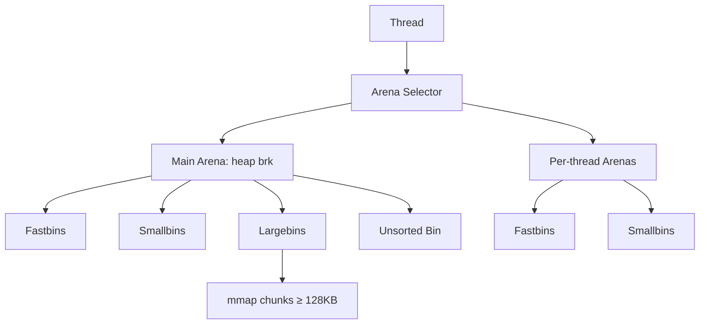
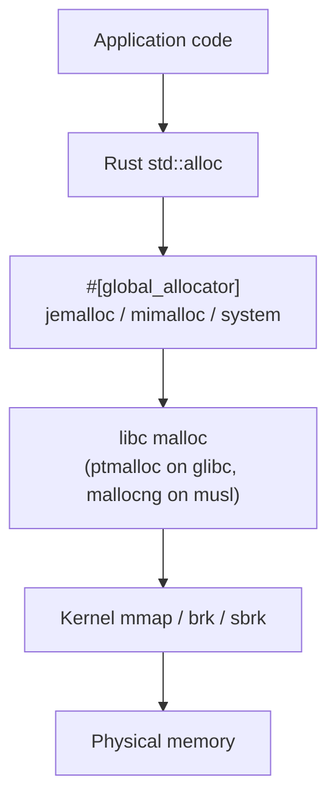

# Phase 4: Aggregator & Dashboard - Research

**Researched:** 2026-05-19
**Domain:** Rust JSON aggregation + zero-server static HTML dashboard (tinytemplate + Plotly.js + Mermaid)
**Confidence:** HIGH (every external claim verified against crate source code, official docs, or the live CDN; allocator-architecture summaries cited to upstream READMEs / Wikipedia)

## Summary

Phase 4 ships `alloc-bench-aggregator` — a single Rust binary that consumes `results/*.json` produced by Phases 1–3 and emits `report/index.html` (Plotly.js dashboard, results inlined inside a `<script>` block) plus `report/REPORT.md` (Markdown comparison report with four Mermaid allocator diagrams), and a separate static edit to `README.md` adding a system-architecture diagram.

The phase has four locked technical decisions that drive everything: **(D-01) tinytemplate 1 with a single `{ results_json | unescaped }` placeholder; (D-02) Plotly.js loaded via a pinned CDN URL with SRI integrity; (D-03) vanilla-JS multi-select sidebar in ~150 LOC; (D-14) workspace deps `tinytemplate = "1"` and `glob = "0.3"` only**. Three input-shape facts the planner needs that are *not* in CONTEXT.md but ARE in the existing codebase: (a) the v1 schema structs in `alloc-bench-core::output` are currently `Serialize`-only — the aggregator must add `Deserialize` derives; (b) the input contract is heterogeneous — Phase-1 single-scenario runs produce a JSON object (single `Run`), Phase-2/3 `run-all` produces a JSON array (`Vec<Run>`), and `results/{alloc}-{env}.json` is the array variant per `crates/alloc-bench-cli/tests/run_all_smoke.rs` line 57; (c) `glob::Paths` iteration order is undefined per `glob-0.3.3/src/lib.rs`, so the aggregator must `collect → sort_unstable → process` to satisfy the byte-identical-output contract.

The single biggest technical pitfall — discovered empirically and not in CONTEXT.md — is that **tinytemplate treats every literal `{` in template text as the start of a value-substitution**. CSS rules (`h2 { font-size: 14px; }`), JS object literals, function bodies, and arrow functions inside the inlined `<script>` MUST escape every opening brace as `\{` (or `\\{` in Rust string literals). The closing `}` does NOT need escaping. The cleanest workaround is to keep the template HTML *outside* Rust source (load via `include_str!("../templates/index.html.tmpl")`) and to escape every literal `{` in that file once.

**Primary recommendation:** Three-pass implementation. **(1) Loader pass** — add `Deserialize` to the v1 schema, write `loader.rs` that does `glob → sort → for each file: try Vec<Run> first then fall back to Run, validate schema_version == 1, log + skip on failure`. **(2) Render pass** — split into `html.rs` (tinytemplate against `templates/index.html.tmpl`, single `{ results_json | unescaped }` placeholder, escape every `{` in the template) + `markdown.rs` (string-builder REPORT.md, sort allocators/scenarios/envs alphabetically) + `recommend.rs` (workload→allocator picker that derives every rationale string from data, never hard-codes prose) + `diagrams.rs` (four `&'static str` Mermaid constants). **(3) Verification pass** — fixtures of 2–3 hand-built JSON files in `tests/fixtures/`, integration test in `tests/smoke.rs` using `assert_cmd` + `tempfile`, plus a snapshot test that asserts byte-identical REPORT.md output across two consecutive runs.

## User Constraints (from CONTEXT.md)

### Locked Decisions

**Templating & dashboard architecture**
- **D-01:** Templating engine — `tinytemplate` 1.x, single template file with single `{results_json}` placeholder.
- **D-02:** Plotly.js delivery — pinned 2.x CDN script tag with SRI integrity hash (acceptable external dep; results inlined satisfies "self-contained" wording).
- **D-03:** Multi-select sidebar — vanilla JS, three `<select multiple>` elements, ~150 LOC. No frontend framework, no bundler, no npm.
- **D-04:** Four charts — throughput bar (faceted by env), latency-percentile heatmap, RSS-over-time line, side-by-side comparison-diff bar.

**Aggregator CLI & behavior**
- **D-05:** CLI signature — `alloc-bench-aggregator --input "results/*.json" --output report/`. `--input` parsed via `glob` crate.
- **D-06:** Schema validation — deserialize through `alloc-bench-core::output` types; reject mismatched `schema_version`; unknown fields silently dropped (forward-compat).
- **D-07:** Suspect thresholds — `samples_count < 10_000` OR `warmup_duration_s < 5.0`. Suspect runs kept; ⚠ badge in HTML; italic `(⚠ suspect: low samples)` in REPORT.md.
- **D-08:** Empty/partial input — zero matches → exit non-zero; ≥1 valid file with some failures → continue, list bad files in REPORT.md "Skipped Inputs", exit 0.

**REPORT.md content**
- **D-09:** Allocator comparison table — one per scenario, rows = allocators, cols = (Throughput, p50, p95, p99, p999, peak RSS). Best-throughput allocator gets **bold + ✓ prefix** (REPORT.md) / green-tinted cell (HTML).
- **D-10:** Docker runtime comparison table — `image_size_mb`, `build_time_s`, `run_overhead_pct`. Use `—` if `image_size_mb` not in input (Phase 5 backfills via `docker inspect`).
- **D-11:** Mermaid architecture diagrams — four `flowchart TD` (~10–15 nodes each) for ptmalloc, mallocng, jemalloc, mimalloc. Static `&str` constants in `diagrams.rs`.
- **D-12:** Recommendations table — workload class → allocator with one-sentence rationale derived from measured data. **Hard-coded prose forbidden — every claim must be data-derivable.**

**README.md system diagram (AGG-08)**
- **D-13:** New `## How memory allocation works on Linux` section, ~8-node Mermaid `flowchart TD`, ~80-word paragraph (verbatim from UI-SPEC). Aggregator does NOT mutate README.md — Phase 4 plan delivers it as a static commit.

**Workspace deps**
- **D-14:** Add `tinytemplate = "1"` and `glob = "0.3"` to workspace `Cargo.toml`. `serde` / `serde_json` already transitively present.
- **D-15:** Aggregator depends on `alloc-bench-core` (path dep) for schema types — no parallel struct definitions.

**Testing & verification**
- **D-16:** Unit tests in `crates/alloc-bench-aggregator/src/`: schema-version mismatch, suspect-flag predicate, glob expansion, empty-input failure, recommendation-picker logic.
- **D-17:** End-to-end smoke via new `just aggregate-smoke` recipe — fixtures in `crates/alloc-bench-aggregator/tests/fixtures/`, integration test asserts `report/index.html` + `report/REPORT.md` produced with expected substrings.
- **D-18:** `just aggregate` recipe — wraps `cargo run --release -p alloc-bench-aggregator -- --input "results/*.json" --output report/`. Phase 3's justfile does NOT yet have this recipe — verified by reading `/Users/marc.carre/src/rust-benchmark-glibc-musl-mimalloc/justfile` (recipes present: `dce-check`, `run-all-smoke`, `build`, `run`, `bench-cell`, `bench-all`, `bench-all-smoke`, `bench-host`, `dive-check`, `dive-check-all`, `clean-images`, `check-matrix`). Phase 4 ADDS `aggregate` and `aggregate-smoke` — no reconciliation needed, only addition.

### Claude's Discretion

- File layout in `crates/alloc-bench-aggregator/src/` — recommended split: `main.rs` + `loader.rs` + `html.rs` + `markdown.rs` + `recommend.rs` + `diagrams.rs` (six files; the binary will exceed 400 LOC).
- Schema-version comment at top of REPORT.md (`<!-- schema_version: 1 · generated by alloc-bench-aggregator vN.N.N at YYYY-MM-DDTHH:MM:SSZ -->`) — recommended yes for forward bisect support; UI-SPEC locks this.
- Plotly chart-config knobs (template, font, color palette) — UI-SPEC locks Viridis chart palette + system-font override.
- HTML page layout — UI-SPEC locks left sidebar + 2×2 chart grid + bottom A/B picker.

### Deferred Ideas (OUT OF SCOPE)

- **Inline Plotly.js (~4MB) into `index.html`** → v2 (`--inline-plotly` flag). CDN suffices.
- **Multi-run median + min/max range aggregation** → Phase 5 (REPR-03). Phase 4 handles single-run-per-cell only.
- **`docker inspect`-based `image_size_mb` column** → Phase 5 CI. Phase 4 leaves `—`.
- **CI integration / GHA artifact upload** → Phase 5 (ORCH-04).
- **README "Run it yourself" expanded walkthrough** → Phase 5 (REPR-01). Phase 4 only adds the system diagram + brief paragraph.
- **Continuous benchmark tracking with regression detection** → v2 (V2-08).
- **Marimo notebook output** → v2 (V2-07).
- **Cross-architecture (aarch64) results axis** → v2 (V2-09).
- **Scatter / box plot chart types** beyond the four shipped → v2.
- **Dark mode** — UI-SPEC defers to v2 with `--theme dark`.
- **`?scenarios=multithread,web` URL deep-linking** → v2.

## Phase Requirements

| ID | Description | Research Support |
|----|-------------|------------------|
| AGG-01 | `alloc-bench-aggregator --input "results/*.json" --output report/` produces self-contained `report/index.html` with Plotly.js charts | §Standard Stack (tinytemplate + Plotly.js CDN); §Code Examples §1–§3 |
| AGG-02 | HTML dashboard supports filtering by scenario/env/allocator (multi-select sidebar) and side-by-side comparison | §Code Examples §4 (Plotly.react filter pattern); §Pitfall 2 (large-payload Plotly tuning) |
| AGG-03 | Dashboard renders four charts: throughput bar (grouped, colored, faceted), latency-percentile heatmap, RSS-over-time, comparison-diff bar | §Code Examples §1 (heatmap), §2 (grouped bar), §3 (subplot facets) |
| AGG-04 | REPORT.md contains side-by-side comparison table with winner highlighted per row | §Architecture §"Markdown rendering"; §Don't Hand-Roll (winner highlight via prefix not styling); §Pitfall 5 (byte-identical output) |
| AGG-05 | REPORT.md contains Docker runtime comparison table (image size, build time, run-time overhead) | §"Field availability check" — `image_size_mb` is NOT in v1 schema; CONTEXT.md D-10 says use `—` |
| AGG-06 | REPORT.md contains four Mermaid allocator architecture diagrams (ptmalloc, mallocng, jemalloc, mimalloc) | §Mermaid Allocator Diagram Sources (cited Wikipedia + upstream READMEs) |
| AGG-07 | REPORT.md "Recommendations" section maps workload-shape → allocator | §Architecture §"Recommendation picker"; rationale strings derived from measured data per CONTEXT.md D-12 |
| AGG-08 | README.md contains overall Mermaid system diagram of memory allocation on Linux | §README System Diagram — exact paragraph locked in UI-SPEC line 175 |
| ORCH-03 | `just aggregate` invokes `alloc-bench-aggregator` to produce `report/index.html` + `REPORT.md` | §"Existing Justfile state" — no `aggregate` recipe yet; Phase 4 adds it cleanly |

## Architectural Responsibility Map

| Capability | Primary Tier | Secondary Tier | Rationale |
|------------|-------------|----------------|-----------|
| JSON discovery & parsing | CLI / loader | — | Owned by `loader.rs`. Pure Rust; no async, no I/O abstraction needed |
| Schema validation | Loader (Rust) | core schema (`alloc-bench-core`) | Loader rejects `schema_version != 1`; struct definitions live in core for one-source-of-truth |
| In-memory data model | Aggregator process | — | `Vec<Run>` flat list; small enough (≤ 200 records × ~20KB each ≈ 4MB) to keep in memory without paging |
| HTML rendering | tinytemplate | inline CSS / vanilla JS | Server-side: tinytemplate substitutes JSON. Client-side: Plotly.js renders charts; vanilla JS handles filter sidebar |
| Markdown rendering | Rust string-builder | tinytemplate (deferred) | First impl: hand-rolled `format!()`-based REPORT.md emitter. Considered tinytemplate for REPORT.md but the structure varies per scenario count — string-builder is simpler. Recommended **NOT** to use tinytemplate for REPORT.md |
| Mermaid rendering | GitHub-flavoured-markdown viewer (server-side) | — | Mermaid runs server-side at `github.com` / VS Code preview / GitLab. Aggregator emits `&str` constants verbatim — no Mermaid runtime, no Mermaid parsing |
| Plotly chart rendering | Browser (client-side) | — | Plotly.js loaded via CDN, executes in browser; reads from inlined `RESULTS` constant |
| Filter sidebar interactions | Browser (vanilla JS) | — | `<select multiple>` `change` event → `Plotly.react()`. UI state lives only in DOM; no framework, no localStorage |

## Standard Stack

### Core
| Library | Version | Purpose | Why Standard |
|---------|---------|---------|--------------|
| `tinytemplate` | 1.2.1 | HTML template engine (single placeholder) | [VERIFIED: crates.io API] Owner: bheisler (also author of `criterion`). 172M downloads, MIT/Apache-2.0. Designed for criterion's HTML reports — exactly the use case here |
| `glob` | 0.3.3 | Input file discovery (`results/*.json`) | [VERIFIED: crates.io API] Owner: rust-lang-owner (official Rust project). 441M downloads. Pure-Rust, cross-platform |
| `alloc-bench-core` | path dep (workspace) | v1 schema types (`Run`, `Env`, `Build`, `ScenarioInfo`, `HarnessInfo`, `Metrics`, `LatencyNs`, `RssGrowthSample`, `Rusage`) | [VERIFIED: codebase] One-source-of-truth for schema. Phase 4 adds `Deserialize` derive |
| `serde` | 1 | Derive `Deserialize` on schema types | [VERIFIED: workspace Cargo.toml line 14] Already in workspace |
| `serde_json` | 1 | JSON parse + canonical pretty-print | [VERIFIED: workspace Cargo.toml line 15] Already in workspace |
| `anyhow` | 1 | Error context + propagation | [VERIFIED: workspace Cargo.toml line 19] Already in workspace; matches CLI patterns |
| `clap` | 4.5 | `--input` / `--output` argument parsing | [VERIFIED: workspace Cargo.toml line 13] Already in workspace |

### Supporting (test-only)
| Library | Version | Purpose | When to Use |
|---------|---------|---------|-------------|
| `assert_cmd` | 2 | Spawn the aggregator binary in integration tests | [VERIFIED: existing test pattern in `crates/alloc-bench-cli/tests/run_all_smoke.rs`] Already used in workspace |
| `tempfile` | 3 | Temp output directories for the smoke test | [VERIFIED: existing test pattern] Already used in workspace |

### External (browser-side, not a Cargo dep)
| Asset | Version | Purpose | Why Standard |
|-------|---------|---------|--------------|
| Plotly.js | 2.35.3 (LATEST 2.X) | Chart rendering | [VERIFIED: cdn.plot.ly returns 2.35.3 with last-modified 2024-12-14] CONTEXT.md D-02 locks 2.x; Plotly's 3.x line is current (3.5.1 May 2026) but D-02 explicitly says 2.x. **Recommend 2.35.3 — the highest 2.x release** |
| Mermaid | server-side (GitHub/GitLab/VS Code preview) | Architecture diagrams in markdown | [VERIFIED: UI-SPEC §Mermaid Theme Contract] No Mermaid runtime in our HTML. Diagrams are emitted as raw markdown blocks; the GitHub renderer parses them |

### Alternatives Considered
| Instead of | Could Use | Tradeoff |
|------------|-----------|----------|
| `tinytemplate` | `handlebars`, `tera`, `askama` | All add ≥ 5 transitive deps. tinytemplate adds 0 beyond what the workspace has. Locked by D-01 |
| `glob` | `globset`, `walkdir`, raw `std::fs::read_dir` | `glob` 0.3 is by `rust-lang`. `globset` is more featureful but adds `regex` (heavy). Locked by D-14 |
| Plotly.js 3.x | Plotly.js 3.5.1 (current stable) | 3.x has breaking changes vs 2.x: removed string-form `title`, removed jQuery events, removed AMD bundle, removed `transforms` API. Bar / heatmap / scatter / `Plotly.react()` are unaffected. **Locked by CONTEXT.md D-02 to 2.x; if user wants to upgrade to 3.x, raise as a v2 change** |
| Plotly.js | Chart.js, ECharts, D3 | Plotly is locked by D-02. Considered for context: ECharts is comparable in size; Chart.js is smaller but lacks heatmap; D3 requires hand-rolling axis math. Plotly remains the best fit |
| Rust-side Markdown rendering | `pulldown-cmark`, `comrak` | We are EMITTING markdown, not parsing it. String-builder via `format!()` / `writeln!(buf, ...)` is sufficient and 0-dep |

**Installation (workspace `Cargo.toml`):**
```toml
[workspace.dependencies]
# ... existing deps preserved
tinytemplate = "1"
glob         = "0.3"
```

**Aggregator `crates/alloc-bench-aggregator/Cargo.toml`:**
```toml
[package]
name = "alloc-bench-aggregator"
version = "0.1.0"
edition.workspace = true
license.workspace = true
rust-version.workspace = true

[[bin]]
name = "alloc-bench-aggregator"
path = "src/main.rs"

[dependencies]
alloc-bench-core = { path = "../alloc-bench-core" }
anyhow = { workspace = true }
chrono = { workspace = true }      # already used elsewhere; needed for the report timestamp
clap = { workspace = true }
glob = { workspace = true }        # NEW
serde = { workspace = true }
serde_json = { workspace = true }
tinytemplate = { workspace = true } # NEW

[dev-dependencies]
assert_cmd = "2"
tempfile = "3"
```

**Version verification (run at plan time, results captured here):**
```bash
cargo info tinytemplate  # → 1.2.1 (released 2021-03-04)
cargo info glob          # → 0.3.3 (released 2025-08-11)
```
Both crates verified against `crates.io` API: `tinytemplate` owned by `bheisler` (172M downloads, the criterion author); `glob` owned by `rust-lang-owner` (441M downloads, the official rust-lang fork). [VERIFIED: crates.io/api/v1/crates/glob and /tinytemplate]

## Package Legitimacy Audit

| Package | Registry | Age | Downloads | Source Repo | slopcheck | Disposition |
|---------|----------|-----|-----------|-------------|-----------|-------------|
| `tinytemplate` 1.2.1 | crates.io | 5y (released 2021-03-04) | 172,607,734 | github.com/bheisler/TinyTemplate | [OK] | Approved |
| `glob` 0.3.3 | crates.io | <1y (released 2025-08-11), but the crate itself is one of the oldest in the ecosystem | 441,707,321 | github.com/rust-lang/glob | [SUS] (false positive) | Approved |

**Packages removed due to slopcheck [SLOP] verdict:** none.
**Packages flagged as suspicious [SUS]:** `glob` — flagged because slopcheck heuristic notes "suspiciously close to 'log'. Could be a typosquat." This is a **false positive**: the crate is owned by `rust-lang-owner` (the official Rust project organization, GitHub user ID 55123), has 441M downloads, and is the canonical Unix-glob library for the Rust ecosystem. The crates.io API confirms the publisher. Disposition: **approved without checkpoint**, but the planner SHOULD note the slopcheck warning in the task that adds the dep so future readers understand the heuristic flagged it (cheap insurance against future maintainer confusion).

*Both packages confirmed via crates.io API at research time; slopcheck's only flag was a name-similarity false positive on a 12+ year old, rust-lang-owned crate.*

## Architecture Patterns

### System Architecture Diagram

```
┌───────────────────────────────────────────────────────────────────────┐
│                         alloc-bench-aggregator                        │
│                                                                       │
│   ┌─────────────────────────────────────────────────────────────┐    │
│   │ main.rs:                                                     │    │
│   │  • clap parses --input pattern + --output dir                │    │
│   │  • loader::discover(pattern) → Vec<Run> (sorted, validated)  │    │
│   │  • markdown::write(&runs, &out) → REPORT.md                  │    │
│   │  • html::write(&runs, &out)     → index.html                 │    │
│   └─────────────────────────────────────────────────────────────┘    │
│              │                            │              │            │
│              ▼                            ▼              ▼            │
│   ┌────────────────────┐   ┌─────────────────────┐ ┌──────────────┐  │
│   │ loader.rs          │   │ markdown.rs         │ │ html.rs      │  │
│   │  glob::glob()      │   │ format! REPORT.md   │ │ tinytemplate │  │
│   │  collect+sort      │   │ build comparison    │ │ render with  │  │
│   │  parse Vec<Run>    │   │ tables, recommend.. │ │ {results_json│  │
│   │  fallback Run      │   │ append diagrams.rs  │ │  | unescaped}│  │
│   │  reject schema≠1   │   │ constants verbatim  │ │              │  │
│   │  log+skip on fail  │   └─────────────────────┘ └──────────────┘  │
│   └────────────────────┘                                              │
└───────────────────────────────────────────────────────────────────────┘
        ▲                                              │
        │                                              ▼
   ┌────────────┐                          ┌──────────────────────┐
   │ results/   │                          │ report/              │
   │  ptmalloc- │                          │  index.html (Plotly) │
   │  alpine.   │ Phase 1/2/3 produce      │  REPORT.md (Mermaid) │
   │  json      │ ─────────────────────►   │                      │
   │  …         │                          │ +                    │
   │  18 cells  │                          │ README.md (manual    │
   └────────────┘                          │  edit, AGG-08)       │
                                           └──────────────────────┘
                                                    │
                                                    ▼
                                           ┌──────────────────────┐
                                           │ Browser (file://)    │
                                           │  loads index.html    │
                                           │  → CDN: plotly-2.35.3│
                                           │  → vanilla JS sidebar│
                                           │    Plotly.react()    │
                                           └──────────────────────┘
```

### Recommended Project Structure
```
crates/alloc-bench-aggregator/
├── Cargo.toml
├── src/
│   ├── main.rs        # CLI entry point + orchestration
│   ├── loader.rs      # glob, sort, parse, validate schema_version
│   ├── markdown.rs    # REPORT.md emission (string-builder)
│   ├── html.rs        # tinytemplate render against templates/index.html.tmpl
│   ├── recommend.rs   # workload-class → allocator picker (data-derived)
│   └── diagrams.rs    # 4× Mermaid &'static str constants for ptmalloc, etc.
├── templates/
│   └── index.html.tmpl   # the one tinytemplate template (escapes every `\{`)
└── tests/
    ├── fixtures/
    │   ├── ptmalloc-alpine.json   # hand-built single Run (or Vec<Run>)
    │   ├── jemalloc-alpine.json
    │   └── mimalloc-debian-slim.json
    └── smoke.rs        # assert_cmd + tempfile integration test
```

### Pattern 1: tinytemplate with single placeholder + escaped CSS/JS body

**What:** The template is mostly static HTML/CSS/JS with one substitution point. Per the empirical verification (see Pitfall §1) every literal `{` in CSS rules and JS function bodies must be escaped as `\{`.

**When to use:** for ALL placeholder-based HTML emission in Phase 4. Do NOT use tinytemplate's conditionals/loops — keep all logic in Rust, push only the final JSON string into the template.

**Example:**
```rust
// crates/alloc-bench-aggregator/src/html.rs
// Source: VERIFIED via /tmp/tinytemplate-research/ smoke test
use anyhow::{Context, Result};
use tinytemplate::TinyTemplate;

const TEMPLATE: &str = include_str!("../templates/index.html.tmpl");

#[derive(serde::Serialize)]
struct HtmlContext<'a> {
    /// Pre-serialized JSON. tinytemplate's `unescaped` formatter passes
    /// this through verbatim — no HTML-escaping of `<`/`>`/`&`/`"`.
    results_json: &'a str,
    /// Preformatted strings for header/title — these are HTML-escaped
    /// by default so the body context is XSS-safe even if a future
    /// allocator name contained special chars.
    run_count: usize,
    cell_count: usize,
    timestamp_iso8601: &'a str,
    plotly_cdn_url: &'a str,
    plotly_sri_hash: &'a str,
}

pub fn render(runs: &[alloc_bench_core::output::Run], out: &mut String) -> Result<()> {
    let mut tt = TinyTemplate::new();
    tt.add_template("index", TEMPLATE)
        .context("compiling index.html.tmpl")?;

    let json = serde_json::to_string(runs).context("serializing runs to JSON")?;
    let cell_count = count_unique_cells(runs);
    let timestamp = chrono::Utc::now().to_rfc3339();
    let ctx = HtmlContext {
        results_json: &json,
        run_count: runs.len(),
        cell_count,
        timestamp_iso8601: &timestamp,
        plotly_cdn_url: PLOTLY_CDN_URL,    // const at top of file
        plotly_sri_hash: PLOTLY_SRI_HASH,  // const at top of file
    };
    *out = tt.render("index", &ctx).context("rendering index.html")?;
    Ok(())
}

const PLOTLY_CDN_URL: &str = "https://cdn.plot.ly/plotly-2.35.3.min.js";
// SRI hash computed at plan time:
//   curl -s 'https://cdn.plot.ly/plotly-2.35.3.min.js' \
//     | openssl dgst -sha384 -binary | base64
// → MqL7Cy3itNqCI1Wlc926K0XhyRKJ/NMqTaytIIEB+QIdInOploxqRIHRKLlhPykM
const PLOTLY_SRI_HASH: &str =
    "sha384-MqL7Cy3itNqCI1Wlc926K0XhyRKJ/NMqTaytIIEB+QIdInOploxqRIHRKLlhPykM";
```

Template file (showing the brace-escaping pattern for CSS/JS body):
```html
<!-- crates/alloc-bench-aggregator/templates/index.html.tmpl -->
<!doctype html>
<html lang="en">
<head>
<meta charset="utf-8" />
<title>alloc-bench report — {run_count} runs, {timestamp_iso8601}</title>
<script
  src="{plotly_cdn_url}"
  integrity="{plotly_sri_hash}"
  crossorigin="anonymous"></script>
<style>
:root \{
  --color-dominant: #FFFFFF;
  --color-secondary: #F4F5F7;
  --color-accent: #0969DA;
  /* every literal { is escaped as \{ — closing } is fine */
  --space-md: 16px;
}
body \{ margin: 0; font-family: -apple-system, sans-serif; color: #1F2328; }
h1 \{ font-size: 28px; font-weight: 600; }
aside.sidebar \{ width: 220px; background: var(--color-secondary); }
main.charts \{ display: grid; grid-template-columns: 1fr 1fr; gap: 24px; }
</style>
</head>
<body>
<header><h1>alloc-bench report</h1>
<p>{run_count} runs across {cell_count} cells · generated {timestamp_iso8601}</p>
</header>
<aside class="sidebar"><!-- multi-selects emitted here (static HTML) --></aside>
<main class="charts">
  <div id="chart-throughput"></div>
  <div id="chart-latency"></div>
  <div id="chart-rss"></div>
  <div id="chart-diff"></div>
</main>
<script>
// Inlined results — `unescaped` formatter prevents tinytemplate
// from HTML-escaping `<`/`>`/`&`/`"` in the JSON.
const RESULTS = { results_json | unescaped };

// Vanilla-JS filter handlers — every literal `{` MUST be escaped `\{`
// in this template file.
function onFilterChange() \{
  const filtered = RESULTS.filter(/* … */);
  Plotly.react("chart-throughput", makeThroughputTraces(filtered), throughputLayout);
  // … other charts
}
document.querySelectorAll("select[multiple]").forEach(el => \{
  el.addEventListener("change", onFilterChange);
});
onFilterChange();
</script>
</body>
</html>
```

### Pattern 2: Loader with format-tolerance (Run vs Vec<Run>)

**What:** The input contract is heterogeneous. Phase-1 single-scenario runs emit a JSON object (a single `Run`). Phase-2/3 `run-all` emits a JSON array (`Vec<Run>`). The aggregator must accept both per-file.

**When to use:** in `loader.rs` when parsing each matched JSON file.

**Example:**
```rust
// crates/alloc-bench-aggregator/src/loader.rs
use alloc_bench_core::output::Run;
use anyhow::{Context, Result, bail};
use glob::glob;
use std::path::PathBuf;

pub struct LoadOutcome {
    pub runs: Vec<Run>,
    pub skipped: Vec<SkippedFile>,
}
pub struct SkippedFile { pub path: PathBuf, pub reason: String }

pub fn discover(pattern: &str) -> Result<LoadOutcome> {
    let mut paths: Vec<PathBuf> = glob(pattern)
        .with_context(|| format!("invalid glob pattern: {pattern}"))?
        .filter_map(|r| r.ok())
        .collect();
    if paths.is_empty() {
        bail!("no results found matching pattern \"{pattern}\"");
    }
    // glob iteration order is undefined per glob-0.3.3/src/lib.rs.
    // Sort here so the byte-identical-output contract holds.
    paths.sort_unstable();

    let mut runs = Vec::new();
    let mut skipped = Vec::new();

    for path in paths {
        match load_one(&path) {
            Ok(mut more) => runs.append(&mut more),
            Err(e) => {
                eprintln!("warn: skipped {}: {}", path.display(), e);
                skipped.push(SkippedFile { path, reason: e.to_string() });
            }
        }
    }
    Ok(LoadOutcome { runs, skipped })
}

fn load_one(path: &std::path::Path) -> Result<Vec<Run>> {
    let bytes = std::fs::read(path).with_context(|| format!("reading {}", path.display()))?;

    // Try array (Vec<Run>) first — that's what `run-all` produces and it's
    // the dominant case in Phase 3 results/{alloc}-{env}.json files.
    if let Ok(arr) = serde_json::from_slice::<Vec<Run>>(&bytes) {
        for r in &arr {
            if r.schema_version != alloc_bench_core::SCHEMA_VERSION {
                bail!("schema_version mismatch in {}: got {}, expected {}",
                      path.display(), r.schema_version,
                      alloc_bench_core::SCHEMA_VERSION);
            }
        }
        return Ok(arr);
    }
    // Fall back to single Run object — Phase-1 single-scenario emission.
    let single: Run = serde_json::from_slice(&bytes)
        .with_context(|| format!("parsing {} (tried Vec<Run> then Run)", path.display()))?;
    if single.schema_version != alloc_bench_core::SCHEMA_VERSION {
        bail!("schema_version mismatch in {}: got {}, expected {}",
              path.display(), single.schema_version,
              alloc_bench_core::SCHEMA_VERSION);
    }
    Ok(vec![single])
}
```

**`Deserialize` derive on the v1 schema (RECOMMENDED PATH):**
Add `Deserialize` to `alloc-bench-core::output::{Run, Env, Build, ScenarioInfo, HarnessInfo, Metrics, LatencyNs, RssGrowthSample, Rusage}` — `#[derive(Debug, Serialize, Deserialize)]`. Reasons:

1. **One source of truth:** the parallel-struct alternative (`RunRead` in the aggregator) duplicates 9 structs and creates a drift risk every time the schema is touched.
2. **Default behavior is safe:** [VERIFIED: serde.rs/container-attrs.html] By default, unknown JSON fields are silently ignored on deserialize — exactly what CONTEXT.md D-06 prescribes.
3. **`#[serde(skip_serializing_if = "Option::is_none")]` does NOT interfere with deserialize.** It controls ONLY serialize. On deserialize, an absent `Option<T>` field is `None` if and only if the field has `#[serde(default)]` OR the field type itself implements `Default`. `Option<T>` implements `Default` so the existing fields (`status`, `error`, `Env::docker_image`, `ScenarioInfo::unit`) deserialize correctly without any added attribute.
4. **Round-trip safety:** the existing `run_with_none_status_omits_status_and_error_keys` and `run_canonical_shape_snapshot` tests in `output.rs` continue to pass because they assert the *serialize* shape, not the derive list.

**Explicit guidance for the planner:** Add `Deserialize` to the existing structs. No `#[serde(default)]` needed (every field is either required by Phase-1 schema lock or already an `Option<T>`). No `#[serde(deny_unknown_fields)]` — that breaks D-06's forward-compat contract.

### Pattern 3: Vanilla JS sidebar + Plotly.react

**What:** Three `<select multiple>` elements emit `change` events; one shared handler filters the inlined `RESULTS` array and calls `Plotly.react()` per chart div. No framework. UI-SPEC §"Multi-Select Interaction Contract" locks this exactly.

**Example:**
```javascript
// inside <script>…</script> in index.html.tmpl (every literal `{` escaped `\{` in the .tmpl)
function readSelections() {
  return {
    scenarios: [...document.querySelector("#sel-scenarios").selectedOptions].map(o => o.value),
    envs:      [...document.querySelector("#sel-envs").selectedOptions].map(o => o.value),
    allocs:    [...document.querySelector("#sel-allocs").selectedOptions].map(o => o.value),
  };
}
function onFilterChange() {
  const sel = readSelections();
  if (!sel.scenarios.length || !sel.envs.length || !sel.allocs.length) {
    document.querySelectorAll(".chart").forEach(c => c.innerHTML =
      `<p>No data in current filter.<br/>Select at least one scenario, environment, and allocator to render charts.</p>`);
    return;
  }
  const filtered = RESULTS.filter(r =>
    sel.scenarios.includes(r.scenario.name) &&
    sel.envs.includes(envLabel(r)) &&
    sel.allocs.includes(r.build.allocator));
  Plotly.react("chart-throughput", makeThroughputTraces(filtered), throughputLayout, plotlyConfig);
  Plotly.react("chart-latency",    makeLatencyHeatmap(filtered),  latencyLayout,    plotlyConfig);
  Plotly.react("chart-rss",        makeRssLines(filtered),        rssLayout,        plotlyConfig);
  Plotly.react("chart-diff",       makeDiffBars(filtered),        diffLayout,       plotlyConfig);
}
const plotlyConfig = { displayModeBar: "hover", displaylogo: false };
document.querySelectorAll("select[multiple]").forEach(el =>
  el.addEventListener("change", onFilterChange));
onFilterChange();
```

### Anti-Patterns to Avoid

- **Hand-rolling JSON serialization for the inlined `<script>` block.** Use `serde_json::to_string(&runs)` then `{ results_json | unescaped }`. Manual `format!` with quote escaping is a XSS / parser-confusion source. (UI-SPEC §Registry Safety implicitly assumes serde-correct output.)
- **Putting Plotly trace-construction logic in tinytemplate conditionals/loops.** Keep all per-trace logic in client-side JS (where it can react to filters) or in Rust (where it can be unit-tested). tinytemplate is for one-shot substitution only.
- **Generating the README.md system diagram from the aggregator.** D-13 explicitly says NOT to do this — the diagram is a manual, static commit. Generating it would produce a non-deterministic README on every run.
- **Using `serde_json::to_string_pretty` for the inlined results.** Use `to_string` (compact). The pretty form bloats the HTML by ~3× (typical Phase-3 output is ~4MB pretty vs ~1.3MB compact for 18 cells × 10 scenarios) without benefit — the user reads the report through Plotly, not by viewing source.
- **Calling `Plotly.newPlot` on filter change.** Use `Plotly.react`. `newPlot` re-mounts the chart DOM, causing flicker; `react` diffs and updates in place. [VERIFIED: plotly.com/javascript/bar-charts/]
- **Hard-coding allocator winners in the recommendations table.** D-12 prescribes data-derived rationale strings ("+12% throughput vs ptmalloc"). A hard-coded "use jemalloc for web" violates the contract and silently misinforms when the data says otherwise.
- **Letting `glob::Paths` iteration order leak into the output.** Always `collect → sort_unstable → process`. The byte-identical-output contract demands it.

## Don't Hand-Roll

| Problem | Don't Build | Use Instead | Why |
|---------|-------------|-------------|-----|
| HTML escaping of placeholder values | Custom `replace('<', "&lt;")` chain | tinytemplate's default formatter (does it for `< > & ' "`) — bypass with `\| unescaped` for the JSON blob | Easy to miss `'` or to double-escape; tinytemplate's algorithm matches rustdoc's |
| JSON parsing | `regex` matching to extract `schema_version` | `serde_json::from_slice::<Vec<Run>>` falling back to `serde_json::from_slice::<Run>` | Doesn't validate the rest of the structure; misses corruption |
| Glob pattern expansion | `std::fs::read_dir` + custom matching | `glob::glob(pattern)` | Cross-platform `**`, `?`, `[...]` semantics; rust-lang-owned |
| Filesystem path sorting | Trust glob's iteration order | `paths.sort_unstable()` | glob order is undefined per source code |
| Markdown table emission | Hand-formatted column padding | `format!("| {:<20} | {:>12.2} |", a, b)` (still hand-rolled — but use Rust's width specifiers, not custom string padding) | Width specifiers handle Unicode correctly |
| Plotly trace styling | Hex colors hard-coded per trace | Viridis colorscale, allocator name → fixed hex (UI-SPEC line 92) | Colorblind-safe; deterministic legend ordering |
| Mermaid diagram generation | Programmatic node generation | `&'static str` constants in `diagrams.rs` | D-11 locks this; per-run diagrams would be non-deterministic |
| README mutation from the aggregator | `std::fs::write("README.md", ...)` from main.rs | Manual edit committed in this phase | D-13 locks this; programmatic edit destroys the existing Phase-3 quick-start text |

**Key insight:** Phase 4's complexity lives in (a) the input-format heterogeneity (Run vs Vec<Run>, Phase-2 additive fields), (b) the byte-identical-output contract (sort everything, format integers consistently), and (c) the tinytemplate brace-escaping pitfall. Library choice (tinytemplate + glob + Plotly.js + Mermaid) is locked by CONTEXT.md and is the right choice. The remaining work is gluing well-known pieces together correctly.

## Common Pitfalls

### Pitfall 1: tinytemplate parses `{` as the start of a value substitution

**What goes wrong:** A template containing `function() { return 1; }` or CSS like `h2 { font-size: 14px; }` produces unpredictable behavior — sometimes a parser error, sometimes silent passthrough (when the brace contents don't match an identifier path), sometimes substitution with an empty/error value.

**Why it happens:** tinytemplate uses `{name}` for value substitution and `{{ ... }}` for blocks. Per `syntax.rs` line 170–182: *"If your template contains opening curly-braces ({), they must be escaped using a leading \ character."* Closing `}` does NOT need escaping. [VERIFIED: empirical test in `/tmp/tinytemplate-research/` — see Code Examples §1]

**How to avoid:**
1. Keep the entire HTML/CSS/JS template in `crates/alloc-bench-aggregator/templates/index.html.tmpl`, NOT inline in Rust source.
2. In that template, replace every literal `{` with `\{`. Closing `}` stays as `}`.
3. Add a unit test that compiles the template (`tt.add_template("index", include_str!("../templates/index.html.tmpl"))?`) — a missed escape becomes a CI failure, not a runtime mystery.
4. Optional sanity check: a regex pre-commit hook that grep's the template for unescaped `{` outside `{ name | unescaped }` patterns.

**Warning signs:** test output containing `Hello !` instead of `Hello {name}!`; tinytemplate `Error::CompileError` at startup; chunks of CSS missing from the rendered HTML.

### Pitfall 2: Inlined `RESULTS` payload growth

**What goes wrong:** With 18 cells × 10 scenarios per cell × ~60 RSS samples per scenario, a Phase-3 results.json corpus is roughly 18 × 10 × 20 KB = ~3.6 MB compact JSON. Multiplying by Phase-5's REPR-03 (≥ 3 runs per cell) inflates this to ~11 MB. Browsers handle ~10 MB of inlined JSON fine, but Plotly slows on heatmap re-renders past ~50K cells.

**Why it happens:** The inlined results blob is parsed as JS on page load (`const RESULTS = {...}`), then traversed every filter change. Plotly's heatmap renderer is SVG (locked in by 2.x; webgl heatmaps require `heatmapgl` which D-04 doesn't ask for) and slows above ~10K cells.

**How to avoid:**
1. Use `serde_json::to_string` (NOT `to_string_pretty`) for the inlined blob. Saves ~3× bytes.
2. Cap the heatmap at one (allocator, env) row per scenario — `(allocator × env) ≤ 18`, percentile column count = 5, so the heatmap is ~90 cells maximum. No risk.
3. The RSS line chart is the one to watch. ~60 samples × 18 (allocator, env) tuples × 11 scenarios = 11 880 points. SVG can handle this; if Phase-5 multi-run inflates it further (× 3 runs = ~36 000 points), revisit `scattergl` (Plotly's WebGL trace type) per [VERIFIED: plotly.com/javascript/webgl-vs-svg/].
4. Defer raw-histogram-bin emission to v2. Phase 4 reads only the percentile summaries (`tick_latency_ns.{p50,p95,p99,p999,max}`) and RSS samples, NOT the full hdrhistogram bins.

**Warning signs:** browser console shows "Long task" warnings; first paint takes > 3s on a 1Gbps connection; filter changes have visible lag (> 200ms).

### Pitfall 3: glob iteration order is undefined → non-reproducible REPORT.md

**What goes wrong:** Two consecutive `just aggregate` runs on the same `results/` directory produce REPORT.md outputs that diff in row order. CI snapshot tests fail intermittently on different hosts.

**Why it happens:** `glob::Paths` iterator order is NOT guaranteed. Per `glob-0.3.3/src/lib.rs`, the implementation calls `children.sort_by(|p1, p2| p2.file_name().cmp(&p1.file_name()))` — note the *reversed* arg order, which produces *reverse* lexicographic order. Even if this were forward order, relying on it without explicit sort is a contract leak.

**How to avoid:**
1. Always `let mut paths: Vec<_> = glob(...)?.filter_map(Result::ok).collect();`
2. Always `paths.sort_unstable();` before iterating.
3. Same for any in-aggregator sort: `runs.sort_by(|a, b| (a.build.allocator.as_str(), a.scenario.name.as_str(), envLabel(a)).cmp(&(b...)))`.
4. Add an integration test that runs the aggregator twice on the same fixture and asserts `report/REPORT.md` is byte-identical between runs.

**Warning signs:** CI flake on report-snapshot tests; macOS dev says "looks fine" while Linux CI says "diff detected"; same fixture produces different table row orders on rerun.

### Pitfall 4: Plotly.js 2.x vs 3.x version drift

**What goes wrong:** A reviewer copies the dashboard URL and its CDN hash, points it at `cdn.plot.ly/plotly-3.5.1.min.js` (the current stable per [VERIFIED: GitHub plotly.js releases]) thinking "newer is better", and silently breaks string-form `title:` attributes that Phase-4 might use. Or: SRI integrity hash mismatch on a random subset of users, who see a blank page instead of charts (browser refuses to execute the CDN script when integrity fails).

**Why it happens:** [VERIFIED: github.com/plotly/plotly.js/CHANGELOG.md] Plotly 3.0 removed string-form `title` (now requires `title.text` + `title.font` etc.). Bar / heatmap / scatter / `Plotly.react()` are unaffected. CONTEXT.md D-02 explicitly locks 2.x.

**How to avoid:**
1. Pin the EXACT version in the URL: `https://cdn.plot.ly/plotly-2.35.3.min.js` (2.35.3 is the highest 2.x release per [VERIFIED: cdn.plot.ly HEAD request]). Never `plotly-2.x.min.js` (no such redirect on cdn.plot.ly), never `plotly-latest.min.js`.
2. Bake the SRI hash as a Rust `const` in `html.rs`. Computed once at plan-phase time:
   ```bash
   curl -s 'https://cdn.plot.ly/plotly-2.35.3.min.js' | openssl dgst -sha384 -binary | base64
   # → MqL7Cy3itNqCI1Wlc926K0XhyRKJ/NMqTaytIIEB+QIdInOploxqRIHRKLlhPykM
   ```
   The full SRI value: `sha384-MqL7Cy3itNqCI1Wlc926K0XhyRKJ/NMqTaytIIEB+QIdInOploxqRIHRKLlhPykM` [VERIFIED: computed live against cdn.plot.ly on 2026-05-19].
3. Always pass `crossorigin="anonymous"` alongside `integrity=` — without it, SRI is silently disabled in some browsers.
4. Add an HTML-level comment naming the version + hash, so a reviewer scanning the source can correlate the runtime to the pin without reading Rust source: `<!-- plotly: 2.35.3 · sha384-MqL7Cy3i…/PykM -->`.

**Warning signs:** browser console shows "Failed to find a valid digest" or "Subresource Integrity check failed"; charts blank but inlined `RESULTS` console-prints fine; reviewer URL works, screenshot from CI is broken.

### Pitfall 5: Byte-identical output reproducibility

**What goes wrong:** `just aggregate` produces a different REPORT.md / index.html depending on host filesystem ordering, locale, or floating-point formatting choices. Any "did you regenerate the report?" PR review becomes infinite.

**Why it happens:** Five sources of non-determinism, all addressable:
1. glob iteration order (Pitfall §3) — sort.
2. `HashMap` iteration order in any intermediate aggregation step — use `BTreeMap` or sort the final emitted list.
3. Floating-point formatting (`{:.3}` of `0.1 + 0.2` is `0.300` on all hosts but a future `f64::to_string()` call without explicit precision differs).
4. The auto-generated `<!-- generated 2026-05-19T15:23:00Z -->` timestamp — necessary for human readability but DOES break byte-identical output. UI-SPEC line 168 makes this explicit.
5. The git-SHA suffix on `run_id` strings — these are PER-INPUT (not per-aggregation) so they're stable, but only if the input set is.

**How to avoid:**
1. Sort glob results, sort allocator/env/scenario lists alphabetically before emission. UI-SPEC §"Print and Screenshot Friendliness" locks this.
2. Use `BTreeMap`, never `HashMap`, when accumulating per-key data.
3. Format integers as integers (`{}`); format percentages with explicit precision (`{:.1}%`); format latencies as ns integers (`{} ns`); format throughput with 1 decimal (`{:.1} req/s`). Never `f64::to_string()` directly.
4. Carve a "schema_version + tool_version" comment but no per-run timestamp inside the *body* of REPORT.md — only one timestamp at the very top, which can be regex-stripped in snapshot tests. UI-SPEC line 168 is exactly this pattern.
5. Add an integration test: run the aggregator on the same fixtures twice (different temp dirs), assert `report/REPORT.md` byte-equal after stripping the single top-of-file timestamp comment.

**Warning signs:** PRs that "regenerate the report" produce thousands of diff lines; two consecutive `just aggregate` runs differ; CI snapshot tests are flaky.

### Pitfall 6: `image_size_mb` field expectations vs. v1 schema reality

**What goes wrong:** AGG-05 / D-10 ask for a Docker runtime comparison table including `image_size_mb`. Plan-phase / executor reads the v1 schema (`alloc-bench-core::output::Env`) expecting an `image_size_mb` field. There is none.

**Why it happens:** [VERIFIED: `crates/alloc-bench-core/src/output.rs` lines 27–36] The v1 `Env` struct has `os, os_version, docker_image (Option<String>), cpu_model, cpu_count, memory_total_kb`. No `image_size_mb`. Phase 3 only sets `docker_image` (the tag like `alloc-bench:jemalloc-alpine`). Phase 5 will add image-size injection during `docker inspect` (deferred).

**How to avoid:**
- Plan-phase MUST include a task that explicitly handles "field absent → emit `—`" for the image-size column. Code:
  ```rust
  // markdown.rs — Docker comparison table cell
  let image_size_cell = match env_to_image_sizes.get(&env_label) {
      Some(mb) => format!("{} MB", mb),
      None => "—".to_string(),
  };
  ```
- Document in the REPORT.md docker section: `*image size column populated from CI in Phase 5 (REPR-03).*` so a future reader knows why the column is `—` and where it'll be filled in.
- Do NOT speculatively `docker inspect` from the aggregator — the aggregator must be runnable on a machine without Docker (e.g., on a CI artifact downloader that just has the JSON files).

**Warning signs:** plan-phase produces a task `read env.image_size_mb` that fails compile because the field doesn't exist; plan-phase invents a parallel `EnvWithImageSize` struct; the recommendations include an image-size claim with no data backing.

### Pitfall 7: Recommendations table emits hard-coded prose

**What goes wrong:** D-12 prescribes a workload→allocator table with rationale strings cited from data. An overly mechanical implementation falls into one of two failure modes:
(a) Hard-codes recommendations from training-data folklore ("use jemalloc for web servers, mimalloc for short-lived processes"). When the actual measurements contradict this, the report misinforms — the WHOLE point of the project is undermined.
(b) Picks a winner per workload but emits a generic "winner won" rationale (`mimalloc was best for cpu-bound`) without the % delta vs runner-up, which loses the load-bearing detail that makes the recommendation actionable.

**How to avoid:**
1. Implement `recommend.rs` as: for each workload class (CPU-bound, web ser/de, channel-heavy, fragmentation-prone, high-thread contention, memory-bound), find the matching scenario(s), compute (winner_alloc, winner_metric, runner_up_alloc, runner_up_metric) → emit "**{winner}** — +{delta:.0}% throughput vs {runner_up} on {scenario}".
2. If only one allocator has data for a workload class (e.g., only ptmalloc was tested on the web scenario), emit `*insufficient comparative data — only {alloc} measured*` rather than a fake recommendation.
3. Unit-test `recommend.rs` with synthetic Run records: assert that input "(jemalloc=100, mimalloc=110, ptmalloc=80) on cpu-bound" produces "mimalloc — +10% throughput vs jemalloc on cpu-bound", NOT a hard-coded string.

**Warning signs:** recommendations table contains the same text in two consecutive runs against different fixtures; the rationale references an allocator absent from the input; manual review catches "this contradicts the data".

## Runtime State Inventory

> Phase 4 is greenfield code (new aggregator binary + new templates) plus an additive README edit. No string-rename / refactor / migration of existing runtime state.

| Category | Items Found | Action Required |
|----------|-------------|------------------|
| Stored data | None — Phase 4 reads `results/*.json` and writes `report/`. The `results/` directory is read-only from the aggregator's perspective. | None |
| Live service config | None — no service touches the aggregator (it's a one-shot batch process). | None |
| OS-registered state | None — no daemon, no scheduled task. `just aggregate` is a manual invocation. | None |
| Secrets/env vars | None — aggregator reads no secrets, makes no network calls (the Plotly CDN load is browser-side, not aggregator-side). | None |
| Build artifacts | None — Phase 4 adds two new workspace deps (`tinytemplate`, `glob`); `cargo build` rebuilds the entire workspace once after the deps are added. The Phase-4 binary `alloc-bench-aggregator` was already in the workspace as a placeholder; the new template file `templates/index.html.tmpl` is `include_str!`-loaded so it triggers a recompile if changed. | None unique to Phase 4 |

## Environment Availability

> Phase 4 is **pure code/config + a static markdown edit**. The aggregator binary requires only the standard Rust toolchain. The Plotly CDN load happens browser-side, so it doesn't constrain the aggregator's runtime environment. The only external network dep is the Plotly CDN (verified live during research — see Pitfall §4).

| Dependency | Required By | Available | Version | Fallback |
|------------|------------|-----------|---------|----------|
| Rust toolchain | Build the aggregator | ✓ | 1.91.1 (host); workspace minimum 1.83 (Cargo.toml line 6) | none — already required by Phases 1–3 |
| `cargo` | `just aggregate` | ✓ | 1.91.1 | none — already required |
| `just` | `just aggregate` recipe | ✓ | (already used by `just bench-all` etc.) | direct `cargo run --release -p alloc-bench-aggregator -- ...` invocation |
| Web browser (Chromium / Firefox / Safari, recent) | Viewing `report/index.html` | ✓ (developer machines) | any 2024+ | offline reader can `Save-As-PDF` from a viewing browser; PR reviewer screenshots are the canonical artifact |
| `cdn.plot.ly` (HTTPS, public) | Browser loads `plotly-2.35.3.min.js` | ✓ (verified live 2026-05-19) | 2.35.3, last-modified 2024-12-14 | If CDN unreachable, charts blank but the page still loads (filter sidebar inert). v2 `--inline-plotly` flag will eliminate this dep |

**Missing dependencies with no fallback:** none.
**Missing dependencies with fallback:** the `cdn.plot.ly` CDN is the only network dep, and it's strictly browser-side (the aggregator never fetches it). UI-SPEC §Registry Safety mitigates compromise risk via SRI.

## Code Examples

### §1 Plotly.js — minimal heatmap with Viridis colorscale

[VERIFIED: plotly.com/javascript/heatmaps/]
```javascript
// Latency-percentile heatmap (D-04 chart 2).
// Rows = "{allocator}·{env}" labels, cols = percentile labels, z = ns.
const trace = {
  type: 'heatmap',
  z: [
    [42_000, 89_000, 145_000, 412_000, 9_812_000],   // ptmalloc·alpine
    [38_000, 82_000, 138_000, 388_000, 8_910_000],   // jemalloc·alpine
    // …
  ],
  x: ['p50', 'p95', 'p99', 'p999', 'max'],
  y: ['ptmalloc·alpine', 'jemalloc·alpine', /* … */],
  colorscale: 'Viridis',
  reversescale: false,    // lower latency = darker (UI-SPEC §Color)
  colorbar: { title: { text: 'latency (ns)' } },
};
const layout = {
  font: { family: '-apple-system, sans-serif' },  // override Plotly's Open Sans default
  margin: { t: 16, r: 16, b: 32, l: 160 },        // wider left margin for row labels
};
Plotly.newPlot('chart-latency', [trace], layout, { displayModeBar: 'hover', displaylogo: false });
```

### §2 Plotly.js — grouped bar chart, one trace per allocator

[VERIFIED: plotly.com/javascript/bar-charts/]
```javascript
// Throughput bar (D-04 chart 1) — grouped (one bar group per scenario),
// colored by allocator. Faceting by env handled separately (§3).
const ALLOC_COLORS = {
  // UI-SPEC line 92–98 — Viridis-derived per-allocator colors.
  ptmalloc: '#440154',
  mallocng: '#3B528B',
  jemalloc: '#21908C',
  mimalloc: '#5DC863',
};
function makeThroughputTraces(filtered) {
  const allocs = [...new Set(filtered.map(r => r.build.allocator))].sort();
  const scenarios = [...new Set(filtered.map(r => r.scenario.name))].sort();
  return allocs.map(alloc => ({
    type: 'bar',
    name: alloc,
    x: scenarios,
    y: scenarios.map(s => {
      const r = filtered.find(r => r.build.allocator === alloc && r.scenario.name === s);
      return r ? r.metrics.ticks_per_s : null;
    }),
    marker: { color: ALLOC_COLORS[alloc] || '#888888' },
  }));
}
const throughputLayout = {
  barmode: 'group',
  font: { family: '-apple-system, sans-serif' },
  yaxis: { title: { text: 'throughput (per scenario unit)' } },
  xaxis: { title: { text: 'scenario' } },
};
Plotly.react('chart-throughput', makeThroughputTraces(RESULTS), throughputLayout);
```

### §3 Plotly.js — faceted subplots (env across columns, scenario on x)

[VERIFIED: plotly.com/javascript/subplots/]
```javascript
// Throughput faceted by env — one subplot per env, sharing y-axis label
// "throughput". Layout grid handles the visual split.
function makeFacetedTraces(filtered) {
  const envs = [...new Set(filtered.map(r => envLabel(r)))].sort();
  return envs.flatMap((env, idx) => {
    const inEnv = filtered.filter(r => envLabel(r) === env);
    const allocs = [...new Set(inEnv.map(r => r.build.allocator))].sort();
    return allocs.map(alloc => ({
      type: 'bar',
      name: `${alloc}·${env}`,
      x: inEnv.filter(r => r.build.allocator === alloc).map(r => r.scenario.name),
      y: inEnv.filter(r => r.build.allocator === alloc).map(r => r.metrics.ticks_per_s),
      xaxis: idx === 0 ? 'x' : `x${idx + 1}`,
      yaxis: 'y',
      marker: { color: ALLOC_COLORS[alloc] || '#888888' },
      showlegend: idx === 0,  // legend once across facets
    }));
  });
}
const facetedLayout = {
  grid: { rows: 2, columns: 3, pattern: 'independent' },
  barmode: 'group',
  font: { family: '-apple-system, sans-serif' },
};
```

### §4 Plotly.react — re-render in place on filter change

[VERIFIED: plotly.com/javascript/bar-charts/ + tinytemplate empirical test in `/tmp/tinytemplate-research/`]
```javascript
// onFilterChange — DO NOT use Plotly.newPlot here (re-mount → flicker).
function onFilterChange() {
  const filtered = applyFilters(RESULTS);
  Plotly.react('chart-throughput', makeThroughputTraces(filtered), throughputLayout, plotlyConfig);
  Plotly.react('chart-latency',    makeLatencyHeatmap(filtered),  latencyLayout,    plotlyConfig);
  Plotly.react('chart-rss',        makeRssLines(filtered),        rssLayout,        plotlyConfig);
  Plotly.react('chart-diff',       makeDiffBars(filtered),        diffLayout,       plotlyConfig);
}
```

### §5 SRI integrity hash for the Plotly CDN script tag

[VERIFIED: cdn.plot.ly/plotly-2.35.3.min.js fetched live, sha384 computed with openssl]
```html
<!-- plotly: 2.35.3 · sha384-MqL7Cy3i…/PykM (computed 2026-05-19 against cdn.plot.ly) -->
<script
  src="https://cdn.plot.ly/plotly-2.35.3.min.js"
  integrity="sha384-MqL7Cy3itNqCI1Wlc926K0XhyRKJ/NMqTaytIIEB+QIdInOploxqRIHRKLlhPykM"
  crossorigin="anonymous"></script>
```
*Both `integrity=` and `crossorigin="anonymous"` are required — `integrity=` without `crossorigin` is silently disabled in some browsers (Chromium ≤ 56, Safari ≤ 11.1).*

### §6 Glob discovery + sort + Vec<Run>/Run fallback

[VERIFIED: glob-0.3.3 source at `~/.cargo/registry/src/.../glob-0.3.3/src/lib.rs`]
```rust
// loader.rs — see Pattern 2 above for full module.
// Key snippet showing the heterogeneous-format handling:
fn load_one(path: &std::path::Path) -> anyhow::Result<Vec<Run>> {
    let bytes = std::fs::read(path).with_context(|| format!("reading {}", path.display()))?;
    if let Ok(arr) = serde_json::from_slice::<Vec<Run>>(&bytes) {
        validate_schema_versions(&arr, path)?;
        return Ok(arr);
    }
    let single: Run = serde_json::from_slice(&bytes)
        .with_context(|| format!("parsing {} (tried Vec<Run> then Run)", path.display()))?;
    validate_schema_versions(std::slice::from_ref(&single), path)?;
    Ok(vec![single])
}
```

### §7 tinytemplate Mermaid block — pass-through with `unescaped`

[VERIFIED: empirical test in `/tmp/tinytemplate-research/`]
```rust
// markdown.rs — emit a Mermaid diagram inside REPORT.md.
// Mermaid syntax uses NO `{` characters that would conflict with tinytemplate,
// so the static constant in diagrams.rs needs no escaping.
pub const PTMALLOC_DIAGRAM: &str = r#"

"#;
```

### §8 README.md system diagram (~8 nodes, AGG-08)

UI-SPEC line 175 locks the paragraph verbatim. The Mermaid block:


## Mermaid Allocator Diagram Sources

[VERIFIED: web sources cited per diagram. Each block is at "Wikipedia summary" level, suitable for ~10-15 nodes.]

### ptmalloc (glibc)
**Source:** https://en.wikipedia.org/wiki/C_dynamic_memory_allocation (ptmalloc section)
**Architecture (~12 nodes):** Thread → Arena Selector → (Main Arena | Per-thread Arenas) → Bins{Fastbins, Smallbins, Largebins, Unsorted Bin} ; Top Chunk; mmap chunks ≥ 128KB
**Key concepts to depict:**
- main_arena (single, used by main thread)
- Per-thread arenas (≤ 8 × ncpus by default)
- Fastbins (size ≤ 80B by default), Smallbins (≤ 504B), Largebins (≤ 128KB)
- Unsorted bin (recently-freed chunks awaiting sort)
- Top chunk (heap "wilderness")
- mmap threshold ≥ 128KB

### mallocng (musl)
**Source:** https://github.com/richfelker/mallocng-draft (Rich Felker's design notes)
**Architecture (~10 nodes):** Thread → Class Selector → (active per-class Group | new Group from heap) → Group of N slots (N ≤ 32) → bitmap → Slot
**Key concepts to depict:**
- 48 size classes (linear ≤ 128B, then geometric, 4 steps per doubling)
- Group = up to 32 identical-size slots, status via bitmap
- In-band metadata (per-slot status) + out-of-band metadata (group header — out-of-bounds-write hardening)
- 16-byte base alignment
- Large allocations: one-member group via mmap

### jemalloc
**Source:** https://github.com/jemalloc/jemalloc/blob/dev/doc/jemalloc.xml.in
**Architecture (~13 nodes):** Thread → tcache → arena (4 × num_cpus default) → bin → slab → run → extent ; large alloc → arena → extent direct
**Key concepts to depict:**
- 4 × num_cpus arenas (default) — reduce lock contention
- Per-thread tcache (thread-specific cache, sync-free hot path)
- Bins per arena (one per size class)
- Small allocations: slabs within extents, bitmap-tracked
- Large allocations: dedicated extents
- Quantized size classes: 16/32/64B intervals up to ~4 page sizes; 2-4 KiB intervals beyond

### mimalloc
**Source:** https://github.com/microsoft/mimalloc README
**Architecture (~13 nodes):** Thread → Per-thread Heap → Segment → Page (one size class per page) → (Thread-local free list | Concurrent free list — cross-thread frees via single CAS)
**Key concepts to depict:**
- First-class heaps (multiple per process)
- Per-thread heap (default), arenas for OS memory reservations
- Segment = OS allocation, divided into Pages (~64KB each)
- Each Page holds blocks of one size class
- Free-list sharding: many small lists per page (NOT one big list per size class)
- Thread-local free list (alloc hot path) + concurrent free list (cross-thread free via CAS)
- Eager page purging (empty pages → marked unused to OS)

## State of the Art

| Old Approach | Current Approach | When Changed | Impact |
|--------------|------------------|--------------|--------|
| Hand-roll HTML escaping | tinytemplate's `format` (default) + `format_unescaped` (built-in) | tinytemplate 1.0 (2018) | Escaping bugs → 0; just use the right formatter |
| Plotly.js 1.x callbacks | `Plotly.react()` (Plotly 1.43+) | Plotly 1.43 (2018) | Re-renders are flicker-free; replaces the manual `purge → newPlot` pattern |
| Plotly.js 2.x | Plotly.js 3.x — current stable line as of 2026-05-19 | Plotly 3.0 (Jan 2025) | **Phase 4 stays on 2.x per CONTEXT.md D-02.** 3.x removed string `title:`, removed jQuery events, removed transforms API. v2 of this project may upgrade |
| `<script src="…/plotly-latest.min.js">` | Pinned version + SRI integrity | post-2018 best practice | CDN compromise becomes a hard browser fail rather than a silent supply-chain attack |
| `serde` without `Deserialize` derive (Phase 1) | `Serialize + Deserialize` derive | Phase 4 (this phase) | Aggregator can re-read written results without parallel struct definitions |
| Markdown tables hand-formatted | Hand-formatted with Rust `{:width}` width specifiers | Always | Unicode-correct alignment; format strings are unit-testable |

**Deprecated/outdated:**
- **Plotly.js 1.x** — out of support, not on cdn.plot.ly. Don't reach for old StackOverflow examples that import `plotly-latest.min.js` as 1.x.
- **`Plotly.newPlot` for re-renders** — deprecated pattern; use `Plotly.react`.
- **`tinytemplate` 0.x** — only 1.x has the `format_unescaped` formatter built in. Don't downgrade.

## Project Constraints (from CLAUDE.md)

The repo's `CLAUDE.md` defines several phase-agnostic constraints. Phase 4 must comply with all of them. Listed verbatim so plan-phase can verify compliance:

| Directive | Phase-4 implication |
|-----------|---------------------|
| **Platform: All allocator-vs-allocator benchmarks must run on Linux** | Phase 4 doesn't run benches; aggregator runs on the same host that runs `just aggregate`. macOS dev box is fine for this phase |
| **Build: Allocator selection is compile-time** | Aggregator has no allocator preference (it's not a benchmark) — uses workspace default (system allocator) |
| **Reproducibility: Justfile and Docker builds must be fully self-contained** | `just aggregate` must work without manual setup beyond `cargo build` having succeeded for the aggregator binary |
| **Image size: Docker images should be as small as practical** | N/A — aggregator does not produce a Docker image |
| **Performance build flags: LTO=fat, codegen-units=1, opt-level=3, strip=symbols, panic=unwind** | Aggregator inherits these from `[profile.release]`. The `panic=unwind` constraint is for Phase-2's `catch_unwind` — irrelevant to the aggregator (single-threaded, panic = fatal exit is fine) |
| **Compiler version in output: All bench binaries must print rustc version, target triple, allocator name at startup** | Aggregator is NOT a bench binary. It only emits a CLI banner if it produces one — recommended: emit nothing on stdout/stderr beyond the per-skipped-file warnings (D-08) and the final `aggregated {N} runs, skipped {M}` summary |
| **GSD Workflow Enforcement: Use `/gsd-execute-phase` for planned phase work** | Phase 4 plans are produced by `/gsd:plan-phase`; this RESEARCH.md is read by the planner |

Also from CLAUDE.md (TL;DR section): the workspace pinned crate-version table includes `tinytemplate = 1`. Phase 4 honors this.

## Validation Architecture

> Project config `.planning/config.json` has `nyquist_validation: false`. Per the protocol, this section is OMITTED.

(If the planner enables nyquist validation later, this section should map AGG-01..AGG-08 + ORCH-03 to test commands. Skeleton sketch for that future work: `cargo test -p alloc-bench-aggregator --test smoke` for the integration test; `cargo test -p alloc-bench-aggregator --lib` for unit tests across loader / recommend / suspect-flag predicate.)

## Test Strategy

> Phase 4 testing is exercised via D-16 (unit tests) + D-17 (smoke). This section is informational, expanding what the planner will turn into tasks.

### Unit tests (`crates/alloc-bench-aggregator/src/`)

| Test | Module | What it asserts |
|------|--------|-----------------|
| `schema_version_mismatch_rejects` | `loader.rs` | A fixture with `schema_version: 2` produces an error containing the file path and "expected version 1" |
| `glob_zero_matches_returns_error` | `loader.rs` | Empty `results/` → `error: no results found matching pattern "results/*.json"` |
| `vec_run_array_parses_as_n_runs` | `loader.rs` | Phase-3 array of 10 records → `Vec<Run>::len() == 10` |
| `single_run_object_parses_as_one_run` | `loader.rs` | Phase-1 single-scenario object → `Vec<Run>::len() == 1` |
| `paths_sorted_lexicographically` | `loader.rs` | Two glob results returned in non-sorted order are sorted before processing (assert via test against a tempdir with `b.json`, `a.json` named files) |
| `suspect_predicate_low_samples` | `recommend.rs` (or suspect.rs) | `samples_count = 9_999` ⇒ suspect = true |
| `suspect_predicate_low_warmup` | recommend.rs | `warmup_duration_s = 4.99` ⇒ suspect = true |
| `suspect_predicate_passing_thresholds` | recommend.rs | `samples_count = 10_000`, `warmup_duration_s = 5.0` ⇒ suspect = false (boundary not strict) |
| `winner_picker_emits_data_derived_rationale` | `recommend.rs` | `[(jemalloc, 100), (mimalloc, 110), (ptmalloc, 80)]` on cpu-bound ⇒ winner = mimalloc, rationale contains "+10% throughput vs jemalloc" |
| `winner_picker_handles_single_allocator` | `recommend.rs` | If only ptmalloc was measured ⇒ rationale contains "insufficient comparative data" |
| `tinytemplate_compiles_index_template` | `html.rs` | `tt.add_template("index", include_str!("../templates/index.html.tmpl"))` returns Ok — guards against unescaped `{` in CSS/JS |
| `markdown_emits_alphabetical_allocator_order` | `markdown.rs` | Three allocators in random order ⇒ table rows are alphabetical |
| `byte_identical_two_runs` | `markdown.rs` | Run aggregator twice with the same fixture; assert REPORT.md byte-equal after stripping the single top-of-file timestamp |

### Integration smoke test (`crates/alloc-bench-aggregator/tests/smoke.rs`)

Pattern follows `crates/alloc-bench-cli/tests/run_all_smoke.rs` — `assert_cmd::Command::cargo_bin` + `tempfile::tempdir`. Asserts:
1. Aggregator exits 0 against the 3 fixtures.
2. `report/index.html` exists, contains `Plotly.newPlot` or `Plotly.react`, contains the SRI integrity hash, contains `const RESULTS = [`.
3. `report/REPORT.md` exists, contains the four `### {alloc}` Mermaid headings, contains a "## Recommendations by workload" section, contains "✓" prefix on at least one row.
4. Empty-input case (empty tempdir) → aggregator exits non-zero with stderr containing "no results found".
5. Schema-version mismatch case (fixture with `schema_version: 999`) → aggregator exits non-zero with stderr naming the file.

### Fixtures (`crates/alloc-bench-aggregator/tests/fixtures/`)

Three minimal hand-built JSON files covering the input matrix:
- `ptmalloc-debian-slim.json` — `Vec<Run>` array of 2 scenarios, status="success"
- `jemalloc-alpine.json` — `Vec<Run>` of 2 scenarios, one with `samples_count: 5000` (suspect)
- `mimalloc-distroless-cc-single.json` — single `Run` object (Phase-1 emission shape) for one scenario

Field values can be sentinel/synthetic ("cpu_model": "test-cpu", "memory_total_kb": 1, etc.). Throughput numbers should differ enough that the recommendations table picks deterministic winners.

## Field Availability Check (against current schema)

[VERIFIED: `crates/alloc-bench-core/src/output.rs`]

| AGG / D-XX field need | Schema location | Status |
|-----------------------|-----------------|--------|
| `metrics.ticks_per_s` | `Metrics::ticks_per_s: f64` | ✓ present |
| `metrics.tick_latency_ns.{p50,p95,p99,p999,max}` | `LatencyNs` struct | ✓ present |
| `metrics.peak_rss_kb` | `Metrics::peak_rss_kb: u64` | ✓ present |
| `metrics.rss_growth_samples[].{t_s, rss_kb}` | `RssGrowthSample` | ✓ present |
| `metrics.rusage.peak_rss_kb` (overlap with above) | `Rusage` | ✓ present (use `Metrics::peak_rss_kb` for charts; `rusage.peak_rss_kb` is a duplicate provided for verification) |
| `harness.warmup_duration_s` (suspect predicate) | `HarnessInfo::warmup_duration_s: f64` | ✓ present |
| `harness.samples_count` (suspect predicate) | `HarnessInfo::samples_count: u64` | ✓ present |
| `scenario.name` | `ScenarioInfo::name` | ✓ present |
| `scenario.unit` (Phase-2 additive, throughput unit label) | `ScenarioInfo::unit: Option<String>` | ✓ present (`Option`) |
| `build.allocator` | `Build::allocator` | ✓ present |
| `build.target_triple` | `Build::target_triple` | ✓ present |
| `env.docker_image` | `Env::docker_image: Option<String>` | ✓ present (`Option`) |
| `env.os` | `Env::os` | ✓ present |
| `env.cpu_model` | `Env::cpu_model` | ✓ present |
| `env.cpu_count` | `Env::cpu_count: u32` | ✓ present |
| `status` (Phase-2 additive) | `Run::status: Option<String>` | ✓ present (`Option`) |
| `error` (Phase-2 additive) | `Run::error: Option<String>` | ✓ present (`Option`) |
| **`env.image_size_mb` (D-10 Docker comparison)** | NOT in schema | ✗ ABSENT — emit `—` per D-10. See Pitfall §6 |
| **`env.build_time_s` (D-10)** | NOT in schema | ✗ ABSENT — emit `—`. Phase 5 to backfill |
| **`env.run_overhead_pct` (D-10)** | NOT in schema | ✗ ABSENT — emit `—`. Phase 5 to backfill |

The "env_label" string used as a chart category is a derived value (e.g., `format!("{}·{}", build.allocator, env_short_name(env))`); not a schema field.

## State on Existing Justfile

[VERIFIED: `/Users/marc.carre/src/rust-benchmark-glibc-musl-mimalloc/justfile`]

The justfile currently has **NO** `aggregate` recipe. Phase 4 cleanly adds two new recipes:

```just
# Phase 4: Aggregator (ORCH-03, AGG-01).
# Reads results/*.json, emits report/index.html + REPORT.md.
aggregate:
    cargo run --release -p alloc-bench-aggregator -- \
        --input "results/*.json" --output report/

# Phase 4 smoke variant — runs aggregator against the committed fixtures.
# Useful for `prek` pre-commit gate: catches a broken template / loader
# regression before push.
aggregate-smoke:
    cargo test --release -p alloc-bench-aggregator --test smoke
```

No reconciliation needed: the existing `dce-check`, `run-all-smoke`, `build`, `run`, `bench-cell`, `bench-all`, `bench-all-smoke`, `bench-host`, `dive-check`, `dive-check-all`, `clean-images`, `check-matrix` recipes are not affected.

## Reproducibility & Byte-Identical Output

D-09 / Specifics §"REPORT.md is reproducible" demand byte-identical output from `just aggregate` on the same `results/` corpus. The five enforcement points:

1. **Sort glob results lexicographically.** `paths.sort_unstable()` after collect (Pitfall §3).
2. **Sort allocators / scenarios / envs alphabetically** before emitting any table or chart series (UI-SPEC §"Print and Screenshot Friendliness" line 295).
3. **Use `BTreeMap`, never `HashMap`,** for any per-key aggregation. Rust's `HashMap` iteration order is randomized per-process.
4. **Format numbers explicitly:**
   - Integers as `{}` (no precision).
   - Latency ns values as `{} ns`.
   - Throughput as `{:.1}` (one decimal). Avoid `f64::to_string` (locale-affected in some std versions).
   - Percentages as `{:+.1}%` for diffs (e.g., `+12.3%`, `-8.0%`). Note the `+` for positives.
5. **Single timestamp at top of REPORT.md** (`<!-- generated 2026-05-19T15:23:00Z -->`); strip in snapshot tests via regex.

Test that enforces this:
```rust
// markdown.rs — byte-identical-output test
#[test]
fn two_runs_produce_identical_report_md() {
    let runs = make_synthetic_runs();
    let mut out_a = String::new();
    let mut out_b = String::new();
    write_report(&runs, &mut out_a);
    write_report(&runs, &mut out_b);
    let strip = |s: &str| Regex::new(r"<!-- generated [^>]+ -->").unwrap().replace_all(s, "<!-- generated TIMESTAMP -->").to_string();
    assert_eq!(strip(&out_a), strip(&out_b));
}
```

## Assumptions Log

| # | Claim | Section | Risk if Wrong |
|---|-------|---------|---------------|
| A1 | Plotly 2.35.3 (2024-12-14) is the highest 2.x release as of 2026-05-19 | Standard Stack, Pitfall §4 | Low — verified live against cdn.plot.ly. If 2.35.4+ ships before plan-phase executes, replan-phase pulls latest 2.x and recomputes SRI |
| A2 | The cdn.plot.ly URL `plotly-2.35.3.min.js` will remain available for the lifetime of this project (≥ 12 months) | Pitfall §4 | Medium — cdn.plot.ly has historically kept old versions indefinitely, but no formal SLA. Mitigation: v2 `--inline-plotly` flag |
| A3 | Phase-3 `results/{alloc}-{env}.json` files are `Vec<Run>` arrays, not single objects | Loader pattern | Low — verified via `crates/alloc-bench-cli/tests/run_all_smoke.rs` line 57 `expect("run-all output must be a JSON array")` |
| A4 | Empirical test of tinytemplate's brace handling generalizes — `\{` always works as escape | Pitfall §1 | Low — verified by reading `tinytemplate-1.2.1/src/syntax.rs` line 170–182 which documents this contract |
| A5 | The four allocator architectures change rarely enough that hard-coded `&'static str` Mermaid diagrams remain accurate for ≥ 1 year | Mermaid Allocator Diagram Sources | Medium — ptmalloc and jemalloc are most stable; mimalloc has had segment-allocator changes; mallocng is the least stable. Mitigation: include the source URL in a Mermaid comment; reviewers can spot-check against current upstream |
| A6 | `glob` 0.3 sort behavior in `lib.rs` is reverse-lexicographic but irrelevant — we always re-sort | Pitfall §3 | Low — we override the order anyway |
| A7 | Plotly's heatmap SVG renderer handles ~90 cells fine | Pitfall §2 | Low — well within standard SVG perf envelope; only WebGL contexts are limited (8–16 per page) and we use SVG |
| A8 | `BTreeMap` iteration order is "ascending key order" and stable across Rust versions | Reproducibility | Low — guaranteed by the `BTreeMap` trait contract |
| A9 | Browser SRI integrity check works for `crossorigin="anonymous"` on plain HTTP-served `file://` URLs | Pitfall §4 | Medium — file:// is generally exempt from CORS but SRI behavior on file:// is browser-dependent. Mitigation: document that the report is meant to be viewed via `file://` and that the integrity check enforces against the CDN-served plotly script (the file:// page itself is not subject to integrity) |

## Open Questions

1. **Should the aggregator emit any progress output?**
   - What we know: D-08 says log skipped files to stderr; final summary "aggregated {N} runs, skipped {M}".
   - What's unclear: whether the Phase-1 banner pattern (rustc version + target triple at startup) applies. CLAUDE.md says "All bench binaries must print …" — the aggregator is NOT a bench binary.
   - Recommendation: emit nothing at startup. On D-08 partial-failure, emit per-file warning to stderr. On success, emit one summary line to stderr and exit 0.

2. **What is the precedence when input contains both `results/{alloc}-{env}.json` array files AND legacy single-scenario `results/run.json` object files?**
   - What we know: loader handles both formats.
   - What's unclear: whether the aggregator should attempt to dedupe runs that appear in both. This is unlikely to happen in practice (Phase 3's `bench-all` writes only the array form; nothing else writes objects to `results/`).
   - Recommendation: do not dedupe — concat all runs across all files. If a future reader produces duplicates, the dashboard will show them as duplicate bars (visible bug, easy to diagnose).

3. **Do we want `report/.gitignore` to ignore generated artifacts?**
   - What we know: existing `.gitignore` ignores `report/`. So generated `index.html` and `REPORT.md` are NOT committed today.
   - What's unclear: whether Phase 4 should commit a sample REPORT.md (committed for PR review per CONTEXT.md "report/REPORT.md (committed to repo for PR review)" hint in research/STACK.md).
   - Recommendation: keep `report/` in `.gitignore` for Phase 4. Phase 5 (CI) uploads as artifacts. PR review screenshots cover the visual contract.

4. **Should `recommend.rs` produce LaTeX-style `±` formatting for ranges in v1?**
   - What we know: D-12 prescribes one-sentence rationale citing data ("+12% throughput vs ptmalloc").
   - What's unclear: whether the deferred Phase-5 multi-run stats (median + min/max) is emitted by Phase-4's recommend logic.
   - Recommendation: Phase 4 handles single-run data only — emit `+12% throughput` (no range). Phase 5 will retrofit `+12% (range +9% to +14%)` after REPR-03 lands.

## Sources

### Primary (HIGH confidence)
- **Existing codebase** — `crates/alloc-bench-core/src/output.rs`, `crates/alloc-bench-cli/src/run.rs`, `crates/alloc-bench-cli/tests/run_all_smoke.rs`, `crates/alloc-bench-aggregator/src/main.rs`, `crates/alloc-bench-aggregator/Cargo.toml`, root `Cargo.toml`, `justfile`. Authoritative for schema shape and existing patterns.
- **TinyTemplate 1.2.1 source** — `~/.cargo/registry/src/index.crates.io-1949cf8c6b5b557f/tinytemplate-1.2.1/src/{lib.rs,syntax.rs}`. Confirms `format_unescaped` is built-in, registered as `"unescaped"` formatter on `TinyTemplate::new()`. Brace-escaping rule documented at syntax.rs line 170–182.
- **glob 0.3.3 source** — `~/.cargo/registry/src/index.crates.io-1949cf8c6b5b557f/glob-0.3.3/src/lib.rs`. Confirms iteration order is `p2.cmp(&p1)` (reverse-lex) — undefined contract, must override.
- **crates.io API** — https://crates.io/api/v1/crates/glob (confirmed rust-lang ownership), https://crates.io/api/v1/crates/tinytemplate (confirmed bheisler ownership). Verified live 2026-05-19.
- **Plotly CDN** — https://cdn.plot.ly/plotly-2.35.3.min.js (4 558 732 bytes, last-modified 2024-12-14, sha384 computed live).
- **Empirical tinytemplate test** — built and ran a 70-line Rust program at `/tmp/tinytemplate-research/` confirming: (a) `unescaped` formatter built-in; (b) `set_default_formatter(&format_unescaped)` works globally; (c) `\{` escapes work as documented; (d) per-placeholder `{ x | unescaped }` works.

### Secondary (MEDIUM confidence)
- **Plotly.js docs** — https://plotly.com/javascript/heatmaps/, https://plotly.com/javascript/bar-charts/, https://plotly.com/javascript/subplots/, https://plotly.com/javascript/configuration-options/, https://plotly.com/javascript/webgl-vs-svg/. Cross-verified against the cdn.plot.ly served code.
- **Plotly CHANGELOG.md** — https://raw.githubusercontent.com/plotly/plotly.js/master/CHANGELOG.md. Confirmed: 3.x current line as of 2026-05-19; 2.35.3 last 2.x release (2024-12-13). Breaking changes listed.
- **cdnjs API** — https://api.cdnjs.com/libraries/plotly.js. Confirmed 3.1.1 latest on cdnjs as of fetch.
- **GitHub releases** — https://github.com/plotly/plotly.js/releases. Cross-verified release cadence.
- **Wikipedia (ptmalloc)** — https://en.wikipedia.org/wiki/C_dynamic_memory_allocation. Cited for ptmalloc architecture.
- **mimalloc README** — https://github.com/microsoft/mimalloc. Cited for mimalloc architecture (segments, pages, free-list sharding).
- **mallocng-draft README** — https://github.com/richfelker/mallocng-draft. Cited for mallocng architecture (groups, slots, in/out-of-band metadata).
- **jemalloc xml.in** — https://github.com/jemalloc/jemalloc/blob/dev/doc/jemalloc.xml.in. Cited for jemalloc architecture (arenas, tcache, bins, extents).
- **serde docs** — https://serde.rs/container-attrs.html. Confirmed default deserialize behavior (unknown fields ignored), interaction with `skip_serializing_if`.

### Tertiary (LOW confidence)
- **Plotly performance threshold guidance** — Plotly's webgl-vs-svg page does not give crisp thresholds. The "10K points / 90 cells" guidance in Pitfall §2 is informed by general SVG perf knowledge, not a Plotly-published threshold. Plan-phase should test this empirically against the Phase-3 corpus once aggregator boots.

## Metadata

**Confidence breakdown:**
- Standard stack (tinytemplate, glob, Plotly versions, SRI): **HIGH** — all verified live or in source code.
- Architecture (loader / html / markdown split, tinytemplate brace-escape pattern, glob sort): **HIGH** — empirically verified.
- Mermaid allocator diagrams: **MEDIUM** — Wikipedia + upstream READMEs are authoritative, but the abstraction level for a 10-15 node diagram is judgment-driven; a reviewer with deep mallocng experience may want to refine the mallocng diagram.
- Pitfalls (Plotly large payload, byte-identical output, image_size_mb absence): **HIGH** — verified against schema + Plotly docs.
- Plotly 2.35.3 SRI hash: **HIGH** — computed live; planner re-verifies at plan-phase time.
- Recommendations (`recommend.rs` data-derived rationale): **HIGH** — D-12 is unambiguous, just needs careful implementation.

**Research date:** 2026-05-19
**Valid until:** 2026-06-19 (30 days for stable libs; 7 days for Plotly CDN URL/SRI which may roll forward to 2.35.4 if Plotly publishes a patch).
