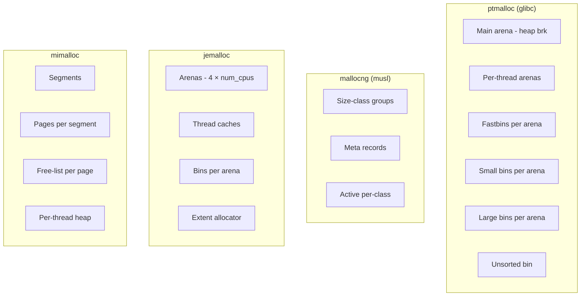

# ARCHITECTURE.md — Benchmark System Design

## Overview

```
┌────────────────────────────────────────────────────────────────────┐
│                       Cargo workspace                              │
│                                                                    │
│  alloc-bench-core  (lib)   alloc-bench-cli  (bin)                  │
│  ├─ harness.rs              ├─ main.rs                             │
│  ├─ scenarios/              ├─ allocator.rs (#[global_allocator])  │
│  │   ├─ multithread.rs      └─ build_info.rs (env! macros)         │
│  │   ├─ web.rs                                                     │
│  │   ├─ channels.rs                                                │
│  │   ├─ cpu_bound.rs                                               │
│  │   ├─ mem_bound.rs                                               │
│  │   ├─ contention.rs                                              │
│  │   ├─ fragmentation.rs                                           │
│  │   └─ realloc_storm.rs                                           │
│  ├─ metrics.rs (rusage, statm, hdr, alloc_stats)                   │
│  └─ output.rs (results.json schema)                                │
│                                                                    │
│  alloc-bench-aggregator  (bin)                                     │
│  └─ Reads results/*.json → emits report/index.html + REPORT.md     │
└────────────────────────────────────────────────────────────────────┘

build.rs at workspace root → injects rustc_version, target, host, profile, git_sha, timestamp
```

## Workspace layout decision

**Decision:** single `alloc-bench-core` library crate + single `alloc-bench-cli` binary crate + single `alloc-bench-aggregator` binary crate. Allocator selected via Cargo features on the `alloc-bench-cli` package — one binary built per allocator combo.

**Why not multi-binary in one crate?** Cargo features are crate-wide; feature unification means you can't have two binaries in the same crate with mutually-exclusive feature sets in one `cargo build`. So: one binary crate (built repeatedly with different features) is cleaner than multi-bin.

**Why not multi-crate workspace (one bench per crate)?** Each scenario shares the harness, metrics, and output code. Splitting them forces awkward dependency graphs. The lib-crate-with-scenarios design is the standard Rust pattern (mirrors how `clap`'s subcommands are structured).

**Build invocation per allocator:**
```
cargo build --release --no-default-features --features alloc-jemalloc -p alloc-bench-cli
cargo build --release --no-default-features --features alloc-mimalloc -p alloc-bench-cli
cargo build --release -p alloc-bench-cli                                 # default = system allocator
```

## Global allocator selection (precise)

```toml
# crates/alloc-bench-cli/Cargo.toml
[features]
default = []                           # use system allocator
alloc-jemalloc  = ["dep:tikv-jemallocator", "dep:tikv-jemalloc-ctl"]
alloc-mimalloc  = ["dep:mimalloc"]

[dependencies]
alloc-bench-core    = { path = "../alloc-bench-core" }
clap                = { version = "4", features = ["derive"] }
tikv-jemallocator   = { version = "0.6", optional = true }
tikv-jemalloc-ctl   = { version = "0.6", optional = true }
mimalloc            = { version = "0.1.43", optional = true, default-features = false }
```

```rust
// crates/alloc-bench-cli/src/allocator.rs
#[cfg(feature = "alloc-jemalloc")]
#[global_allocator]
static GLOBAL: tikv_jemallocator::Jemalloc = tikv_jemallocator::Jemalloc;

#[cfg(feature = "alloc-mimalloc")]
#[global_allocator]
static GLOBAL: mimalloc::MiMalloc = mimalloc::MiMalloc;

pub fn name() -> &'static str {
    #[cfg(feature = "alloc-jemalloc")] { return "jemalloc"; }
    #[cfg(feature = "alloc-mimalloc")] { return "mimalloc"; }
    if cfg!(target_env = "musl") { "mallocng" }
    else if cfg!(target_os = "macos") { "libmalloc" }
    else { "ptmalloc" }
}
```

Mutual exclusion: a startup assertion in `main.rs` panics if both `alloc-jemalloc` and `alloc-mimalloc` are enabled. Cargo's feature-unification can't enforce this at compile time within a single binary.

## Results JSON schema

```json
{
  "schema_version": 1,
  "run_id": "2026-05-17T12:34:56Z-deadbeef",
  "env": {
    "os": "linux",
    "os_version": "6.6.30",
    "docker_image": "alpine:3.20",
    "cpu_model": "AMD Ryzen 9 7950X",
    "cpu_count": 32,
    "memory_total_kb": 67108864
  },
  "build": {
    "allocator": "jemalloc",
    "rustc_version": "rustc 1.83.0 (90b35a623 2024-11-26)",
    "target_triple": "x86_64-unknown-linux-musl",
    "host_triple": "x86_64-apple-darwin",
    "profile": "release",
    "git_sha": "b7f06d7...",
    "build_timestamp": "2026-05-17T10:00:00Z",
    "rustflags": "-C target-cpu=x86-64-v3 -C lto=fat -C codegen-units=1"
  },
  "scenario": {
    "name": "multithread_alloc",
    "config": {
      "threads": 16,
      "objects_per_thread": 100000,
      "size_distribution": "uniform-16-1024"
    }
  },
  "harness": {
    "warmup_duration_s": 5,
    "measurement_duration_s": 60,
    "samples_count": 1234567
  },
  "metrics": {
    "throughput_ops_per_s": 458231.4,
    "latency_ns": {
      "p50": 142,
      "p95": 312,
      "p99": 891,
      "p999": 4312,
      "max": 18234
    },
    "peak_rss_kb": 142336,
    "rss_growth_samples": [
      {"t_s": 0, "rss_kb": 8192},
      {"t_s": 1, "rss_kb": 64512},
      {"t_s": 2, "rss_kb": 102400}
    ],
    "rusage": {
      "user_time_s": 42.1,
      "sys_time_s": 3.2,
      "minor_faults": 38291,
      "major_faults": 0,
      "voluntary_csw": 1842,
      "involuntary_csw": 12
    },
    "allocator_stats": {
      "kind": "jemalloc",
      "allocated_bytes": 134217728,
      "resident_bytes": 145752064,
      "retained_bytes": 8388608,
      "active_bytes": 142606336
    }
  }
}
```

One JSON object per `(allocator × env × scenario × scenario_config)` run. Aggregator merges all of them.

## Custom harness architecture

```rust
pub struct Harness<'s, S: Scenario> {
    scenario: &'s mut S,
    warmup: Duration,
    measure: Duration,
}

impl<S: Scenario> Harness<'_, S> {
    pub fn run(&mut self) -> Result {
        // Phase 1: warm-up (no measurement)
        let warmup_end = Instant::now() + self.warmup;
        while Instant::now() < warmup_end {
            std::hint::black_box(self.scenario.tick());
        }

        // Phase 2: measurement
        let mut hist = Histogram::<u64>::new_with_bounds(1, 60_000_000_000, 3)?;
        let mut rss_samples = Vec::new();
        let measure_start = Instant::now();
        let measure_end = measure_start + self.measure;
        let mut last_rss_sample = measure_start;

        let mut count: u64 = 0;
        while Instant::now() < measure_end {
            let t0 = Instant::now();
            std::hint::black_box(self.scenario.tick());
            hist.record(t0.elapsed().as_nanos() as u64)?;
            count += 1;
            if last_rss_sample.elapsed() >= Duration::from_secs(1) {
                rss_samples.push(read_proc_statm_rss()?);
                last_rss_sample = Instant::now();
            }
        }

        let elapsed = measure_start.elapsed();
        let alloc_stats = sample_allocator_stats();
        let rusage = read_rusage();

        Ok(Result { hist, rss_samples, count, elapsed, alloc_stats, rusage })
    }
}

pub trait Scenario {
    fn setup(&mut self);
    fn tick(&mut self);  // one unit of work; allocations happen here
    fn teardown(&mut self);
}
```

**Critical correctness:** `std::hint::black_box(self.scenario.tick())` prevents the compiler from optimizing away the entire workload. Inside `tick()`, returned values must also be black-boxed before being dropped — see PITFALLS.md §1.

## Web-bench design

Two tokio runtimes in the same process:
- **Server runtime** (4 worker threads): runs axum server on `127.0.0.1:0` (kernel-assigned port).
- **Load-gen runtime** (configurable workers): runs N hyper clients hammering the server.

Both observed by the harness: load-gen records per-request latency to hdrhistogram; throughput = total_requests / measurement_duration.

```rust
async fn web_bench(config: WebConfig) -> ScenarioResult {
    let server_rt = tokio::runtime::Builder::new_multi_thread()
        .worker_threads(config.server_workers).enable_all().build()?;
    let server_handle = server_rt.spawn(run_axum_server(config.bind_addr));
    let port = await_server_ready(&server_handle).await?;

    // load-gen runs in current runtime
    let mut hist = Histogram::new_with_bounds(1, 60_000_000_000, 3)?;
    let warmup = tokio::time::Instant::now() + config.warmup;
    while tokio::time::Instant::now() < warmup {
        send_request(port).await?;
    }
    // measurement loop (with hist.record per request)
    // …
}
```

Why in-process load gen: removes inter-process/network noise; pinpoints allocator behavior on both server and client (both share the global allocator).

## Cross-compilation strategy

**Per-environment Dockerfile pattern** with cargo-chef. Each Dockerfile in `docker/<env>.Dockerfile`:

```dockerfile
ARG RUST_VERSION=1.83
FROM rust:${RUST_VERSION}-slim AS chef
RUN cargo install --locked cargo-chef@0.1.71
WORKDIR /app

FROM chef AS planner
COPY . .
RUN cargo chef prepare --recipe-path recipe.json

FROM chef AS builder
ARG ALLOC_FEATURE=""
ARG TARGET=x86_64-unknown-linux-gnu
RUN rustup target add ${TARGET}
COPY --from=planner /app/recipe.json recipe.json
RUN cargo chef cook --release --target ${TARGET} \
    ${ALLOC_FEATURE:+--features ${ALLOC_FEATURE}} --recipe-path recipe.json
COPY . .
RUN cargo build --release --target ${TARGET} -p alloc-bench-cli \
    ${ALLOC_FEATURE:+--no-default-features --features ${ALLOC_FEATURE}}

FROM <env-specific-base> AS runtime
COPY --from=builder /app/target/${TARGET}/release/alloc-bench-cli /usr/local/bin/
LABEL org.opencontainers.image.title="alloc-bench" \
      org.opencontainers.image.description="Memory allocator benchmark — ${ALLOC_FEATURE}" \
      org.opencontainers.image.source="https://github.com/.../rust-benchmark-glibc-musl-mimalloc" \
      org.opencontainers.image.licenses="MIT OR Apache-2.0"
ENTRYPOINT ["/usr/local/bin/alloc-bench-cli"]
```

Per-env runtime stages:
- `alpine:3.20` (musl dynamic) — for mallocng
- `debian:bookworm-slim` (glibc dynamic) — for ptmalloc
- `gcr.io/distroless/cc-debian12` — for jemalloc/mimalloc on glibc (needs cc/glibc)
- `gcr.io/distroless/static-debian12` — for jemalloc/mimalloc on musl static
- `cgr.dev/chainguard/static` — for fully static musl
- `cgr.dev/chainguard/wolfi-base` — for glibc with up-to-date base
- `scratch` — for fully static musl + crt-static

**Static linking** for distroless-static / scratch / chainguard-static targets:
```
RUSTFLAGS="-C target-feature=+crt-static -C target-cpu=x86-64-v3 -C lto=fat -C codegen-units=1"
cargo build --release --target x86_64-unknown-linux-musl
```

## Justfile matrix

```just
allocators := "ptmalloc jemalloc mimalloc mallocng"
envs       := "alpine debian-slim distroless-cc distroless-static scratch wolfi"

# Build all combos in parallel (where the matrix is meaningful)
build-all:
    parallel -j $(nproc) just build {1} {2} ::: {{allocators}} ::: {{envs}}

build allocator env:
    docker buildx build \
        -f docker/{{env}}.Dockerfile \
        --build-arg ALLOC_FEATURE=$(if [ "{{allocator}}" = "jemalloc" ]; then echo "alloc-jemalloc"; \
                                     elif [ "{{allocator}}" = "mimalloc" ]; then echo "alloc-mimalloc"; \
                                     else echo ""; fi) \
        --build-arg TARGET=$(if [ "{{env}}" = "alpine" ] || [ "{{env}}" = "scratch" ] || \
                                 [ "{{env}}" = "distroless-static" ] || [ "{{env}}" = "chainguard-static" ]; \
                              then echo "x86_64-unknown-linux-musl"; \
                              else echo "x86_64-unknown-linux-gnu"; fi) \
        --tag alloc-bench:{{allocator}}-{{env}} \
        --load .

bench allocator env scenario="all":
    mkdir -p results
    docker run --rm --cpus=4 --memory=4g \
        -v $(pwd)/results:/out alloc-bench:{{allocator}}-{{env}} \
        run --scenario {{scenario}} --output /out/{{allocator}}-{{env}}-{{scenario}}.json

bench-all:
    @for a in {{allocators}}; do for e in {{envs}}; do just bench $a $e; done; done

aggregate:
    cargo run --release -p alloc-bench-aggregator -- \
        --input "results/*.json" --output report/

dive allocator env:
    dive alloc-bench:{{allocator}}-{{env}} --ci

bench-host scenario="all":
    cargo build --release -p alloc-bench-cli
    ./target/release/alloc-bench-cli run --scenario {{scenario}} \
        --output results/host-system.json
```

## Aggregator pipeline

```
results/*.json
    │
    ▼
alloc-bench-aggregator (Rust binary)
    │  - Loads all JSON
    │  - Validates schema
    │  - Builds in-memory dataframe (Vec<RunRecord>)
    │  - Generates HTML by tinytemplate substitution into report/template.html
    │    (template embeds Plotly.js CDN + JSON data inline)
    │  - Generates Markdown REPORT.md with comparison tables + Mermaid diagrams
    ▼
report/index.html  (open in browser, no server needed)
report/REPORT.md   (committed to repo for PR review)
```

Plotly views shipped in the HTML:
1. Throughput bar chart, grouped by scenario, colored by allocator, faceted by env
2. Latency percentile heatmap (allocator × percentile)
3. RSS-over-time line chart, one line per (allocator, env)
4. Side-by-side comparison: pick two configs, see diff bar chart
5. Filter sidebar (scenario / env / allocator multi-select)

## Mermaid diagrams (allocator architectures)

To embed in REPORT.md:



(Detail per allocator goes in REPORT.md; here we just sketch.)

## Build-order implications

1. **Phase 1** must establish the workspace + global-allocator pattern + first scenario + the harness.
2. **Phase 2** adds remaining scenarios + metrics infrastructure. Can be done in parallel plans because each scenario is independent given the harness contract.
3. **Phase 3** builds the Docker matrix. Depends on phase 1 for build correctness.
4. **Phase 4** builds the aggregator + Plotly HTML. Depends on phases 1-2 for the JSON schema + sample data.
5. **Phase 5** wires CI + Justfile + writes REPORT.md/README.md/Mermaid.

Phases 2 and 3 can overlap: scenario authoring doesn't depend on Docker matrix.
