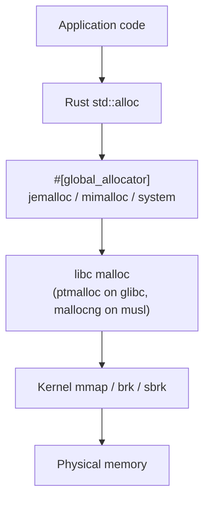

# rust-benchmark-glibc-musl-mimalloc

## How memory allocation works on Linux

When a Rust program calls `Vec::new()` or `Box::new(x)`, the request travels through `std::alloc` → the configured `#[global_allocator]` (jemalloc / mimalloc / system) → libc malloc (ptmalloc on glibc, mallocng on musl) → the kernel's `mmap` / `brk` / `sbrk` → physical memory. Each layer can change the cost, fragmentation profile, and tail-latency shape of an allocation. This benchmark measures those differences across four allocators, six libc·env combinations, and eleven workload scenarios.

