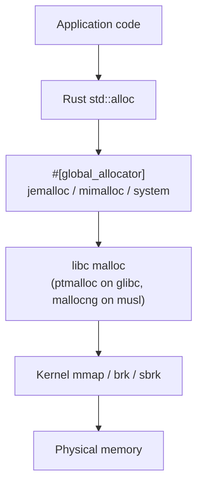

[](https://github.com/marccarre/rust-benchmark-glibc-musl-mimalloc/actions/workflows/bench.yml)

# rust-benchmark-glibc-musl-mimalloc

> Reproducible Rust allocator benchmarks across glibc/ptmalloc, musl/mallocng, jemalloc, and mimalloc — six libc·environment combinations × ten workload scenarios.

This benchmark suite measures four memory allocators (glibc/ptmalloc, musl/mallocng, jemalloc, mimalloc) across eighteen meaningful (env × allocator) cells and ten workload scenarios (micro-allocation stress, web-service request/response, SPMC/MPSC/MPMC channel pipelines, CPU-bound, memory-bound, lock-contention). Every run is environment-labelled, dual-libc reproducible, and aggregated into both an interactive Plotly HTML dashboard at `report/index.html` and a Markdown report (`report/REPORT.md`) with Mermaid.js architecture diagrams. The GitHub Actions matrix runs on `ubuntu-24.04` with three seeds per cell to capture the *shape* of the curve (relative ordering across allocators), while the local `just bench-all` recipe is the canonical *statistical-quality* measurement (longer warmup + duration + more samples). Results carry both `⚠ suspect` (low samples / short warmup) and `⚠ high variance` (CV > 10%) flags so the reader always knows how much weight to put on a given number.

## How memory allocation works on Linux



When a Rust program calls `Vec::new()` or `Box::new(x)`, the request travels through `std::alloc` → the configured `#[global_allocator]` (jemalloc / mimalloc / system) → libc malloc (ptmalloc on glibc, mallocng on musl) → the kernel's `mmap` / `brk` / `sbrk` → physical memory. Each layer can change the cost, fragmentation profile, and tail-latency shape of an allocation. This benchmark measures those differences across four allocators, six libc·env combinations, and ten workload scenarios.

## Run it yourself

The full reproduction loop is five steps. Pick the **smoke run** to verify the pipeline end-to-end in ~10 minutes, or the **full run** for canonical statistical-quality numbers (~2.5 hours, ~5 GB disk).

1. **Install Docker Desktop and just.**
   - macOS: `brew install --cask docker` (or `brew install colima` for a lighter daemon) and `brew install just`.
   - Linux: install Docker Engine via your distro's package manager and `cargo install just` (or your distro's `just` package).
2. **Clone the repo:**
   ```bash
   git clone https://github.com/marccarre/rust-benchmark-glibc-musl-mimalloc.git
   cd rust-benchmark-glibc-musl-mimalloc
   ```
3. **Run the matrix.** Two recipes are available:
   - **Smoke run (~10 min)** — `just bench-all-smoke`. Uses `--warmup 1s --duration 5s` per scenario across all 18 cells × 10 scenarios × 3 seeds. Proves the loop end-to-end and catches regressions in *relative ordering*; not a statistical-quality run on its own (the smoke recipe is below the documented sample-count floor — see `.planning/research/PITFALLS.md` §1.4).
   - **Full run (~2.5 hours, ~5 GB disk)** — `just bench-all`. Uses `--warmup 5s --duration 60s` per scenario, the canonical statistical-quality measurement. Plan ~5 GB of free disk for the per-cell `results/*.json` plus the rendered `report/`.

   The trade-off in one line: smoke proves the loop; full run is the canonical statistical-quality measurement.
4. **Aggregate the results into a report:**
   ```bash
   just aggregate
   ```
   This runs the `alloc-bench-aggregator` binary over `results/*.json` and emits `report/index.html` + `report/REPORT.md`.
5. **Open the dashboard:**
   - macOS: `open report/index.html`
   - Linux: `xdg-open report/index.html`

   The HTML dashboard is fully self-contained (Plotly bundled, no external JS or server required) — open it from a web browser, an `scp`'d laptop, or behind an air-gap.

### Troubleshooting

- **Apple Silicon (M1/M2/M3/M4):** the build script already passes `--platform linux/amd64` to every `docker build` and `docker run` invocation (Phase 3 D-15) so the AMD64 emulation layer in Docker Desktop / Colima / OrbStack handles execution. **Caveat:** Rosetta-2 emulates the v1 baseline + SSE4.2 + AVX1 but does NOT reliably execute AVX2 / BMI2, and Phase 3 D-09's `RUSTFLAGS=-C target-cpu=x86-64-v3` baseline emits AVX2/BMI2 — so a stock `just bench-all-smoke` SIGSEGVs on launch (exit code 139) on an Apple Silicon host. The fix: `BENCH_TARGET_CPU=x86-64-v2 just bench-all-smoke` rebuilds the images with a v2 baseline (SSE4.2 / POPCNT — known-supported by Rosetta) and the matrix runs to completion. The shortcut `just bench-all-smoke-apple-silicon` does the same one-liner. The `build` recipe also auto-detects `uname -m == arm64 && uname -s == Darwin` and applies the v2 default automatically when no override is set. **Reproducibility caveat:** numbers from a v2-codegen Apple-Silicon run are NOT byte-comparable with a v3-codegen CI run; relative ordering between allocators stays valid for qualitative comparison. Expect ~2-4× slower wall-clock than a native AMD64 host either way.
- **Hyperthreading / shared cores:** every benchmark `docker run` is locked to `--cpus=4 --cpuset-cpus=0-3` so threads land on the first four physical cores (Phase 3 D-15). If your host has fewer than 4 physical cores, the cpuset will straddle SMT siblings and numbers will be noisier — switch to a host with ≥4 cores or interpret CV as upper-bound.
- **NUMA:** on multi-socket hosts, the build pins via `--cpuset-cpus` only — no `numactl --membind` (Phase 3 D-16). For a single-socket workstation this is a no-op; on a NUMA host, remember the allocator-vs-allocator comparison is intra-socket only.
- **Low memory / mimalloc OOM-kill:** if mimalloc OOM-kills on a memory-bound scenario (default container memory is `--memory=4g`), raise it via the `BENCH_MEMORY` override (Phase 3 D-17):
  ```bash
  BENCH_MEMORY=8g just run alpine jemalloc
  ```

## Allocator matrix overview

The eighteen meaningful cells, in the same order as `justfile:_matrix_cells`. Cross-libc combos (mallocng-on-glibc, ptmalloc-on-musl) are physically impossible and structurally absent from the matrix.

| env               | alloc    | libc  | target                          |
| ----------------- | -------- | ----- | ------------------------------- |
| debian-slim       | ptmalloc | glibc | x86_64-unknown-linux-gnu        |
| debian-slim       | jemalloc | glibc | x86_64-unknown-linux-gnu        |
| debian-slim       | mimalloc | glibc | x86_64-unknown-linux-gnu        |
| distroless-cc     | ptmalloc | glibc | x86_64-unknown-linux-gnu        |
| distroless-cc     | jemalloc | glibc | x86_64-unknown-linux-gnu        |
| distroless-cc     | mimalloc | glibc | x86_64-unknown-linux-gnu        |
| wolfi             | ptmalloc | glibc | x86_64-unknown-linux-gnu        |
| wolfi             | jemalloc | glibc | x86_64-unknown-linux-gnu        |
| wolfi             | mimalloc | glibc | x86_64-unknown-linux-gnu        |
| alpine            | mallocng | musl  | x86_64-unknown-linux-musl       |
| alpine            | jemalloc | musl  | x86_64-unknown-linux-musl       |
| alpine            | mimalloc | musl  | x86_64-unknown-linux-musl       |
| distroless-static | mallocng | musl  | x86_64-unknown-linux-musl       |
| distroless-static | jemalloc | musl  | x86_64-unknown-linux-musl       |
| distroless-static | mimalloc | musl  | x86_64-unknown-linux-musl       |
| scratch           | mallocng | musl  | x86_64-unknown-linux-musl       |
| scratch           | jemalloc | musl  | x86_64-unknown-linux-musl       |
| scratch           | mimalloc | musl  | x86_64-unknown-linux-musl       |

## Reproducibility

Every measurement in this repo is reproducible byte-for-byte (modulo runner-CPU shared-tenancy noise). The pinned inputs are:

- **rustc 1.91** — pinned via `rust-toolchain.toml` (`channel = "1.91"`). All six `docker/*.Dockerfile` images and `justfile:79` use the same `--build-arg RUST_VERSION=1.91`. CI installs the toolchain via `dtolnay/rust-toolchain@1.91.0` (patch-pinned). The workspace `Cargo.toml` declares `rust-version = "1.83"` separately — that is the **MSRV** (minimum supported version for downstream consumers), NOT the build-time pin.
- **Six pinned Docker base images** — `alpine:3.20`, `debian:bookworm-slim`, `gcr.io/distroless/cc-debian12:nonroot`, `gcr.io/distroless/static-debian12:nonroot`, `cgr.dev/chainguard/wolfi-base:latest`, `scratch` (Phase 3 D-05). Each Dockerfile sets `ARG RUST_VERSION=1.91` and `target-cpu=x86-64-v3` consistently.
- **Build flag `RUSTFLAGS="-C target-cpu=x86-64-v3"`** (Phase 3 D-09) — same flag in CI and Docker images so the runner-CPU and the in-image binary agree on the instruction set. Critically, `target-cpu=native` is forbidden — GHA hosted runners migrate between CPU types stochastically, and a native-tuned binary would crash with illegal-instruction on a different runner. (Apple Silicon hosts running under Rosetta require a v2 downgrade — see [§Troubleshooting → Apple Silicon](#troubleshooting) for the `BENCH_TARGET_CPU=x86-64-v2` override.)
- **GHA hardware** — `ubuntu-24.04` free tier, 4 vCPU / 16 GB RAM. The CI matrix proves the pipeline runs and catches regressions in *relative ordering across allocators*; absolute numbers vary across runs because the runner CPU is shared with other tenants. CI duration target is ~60 min p95 wall-clock for the full 18-cell × 10-scenario × 3-seed smoke matrix at full parallelism. The local `just bench-all` recipe on a quiet host is the canonical statistical-quality measurement.
- **Pitfalls list** — see [`.planning/research/PITFALLS.md`](.planning/research/PITFALLS.md) for the full taxonomy of "things that bias allocator benchmarks": sample-count floors, target-cpu portability, multi-run aggregation conventions, rustc pinning hygiene, and shared-tenant noise.

Reports also surface two read-time variance flags so the reader always knows how much weight a number deserves:

- `⚠ suspect` — the run had `samples_count < 10_000` or `warmup_duration_s < 5.0`.
- `⚠ high variance` — across ≥3 runs of the same `(alloc, env, scenario)` tuple, the coefficient of variation `stddev / mean × 100%` exceeds 10% (Bessel-corrected sample stddev, n-1 denominator).

## License

Dual-licensed under [Apache License 2.0](LICENSE-APACHE) or [MIT License](LICENSE-MIT) at your option. The Cargo.toml SPDX expression is `Apache-2.0 OR MIT`.
